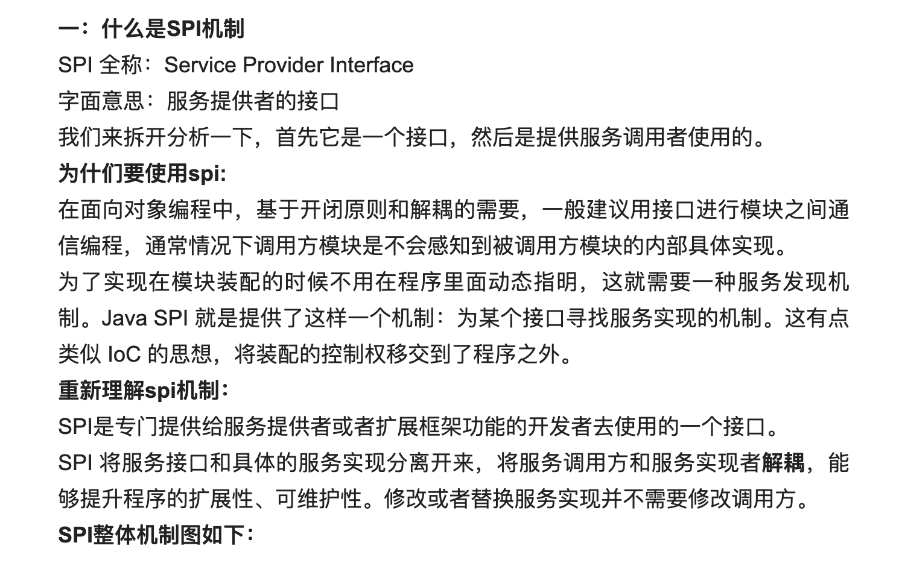
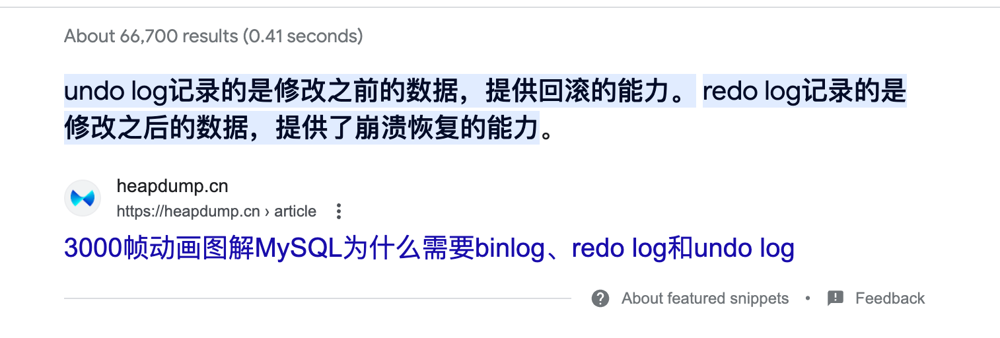
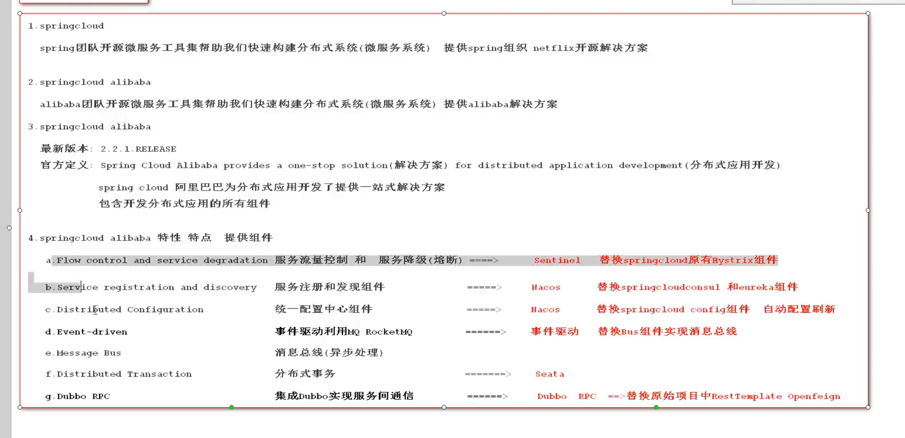
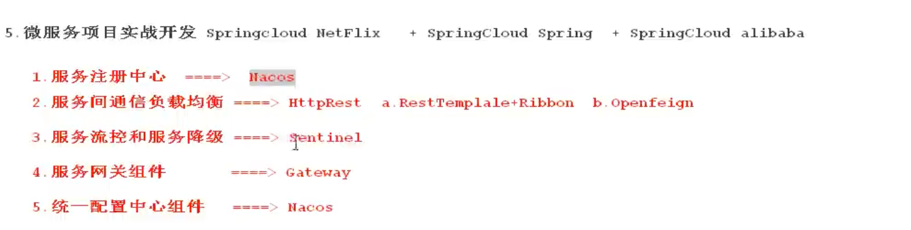
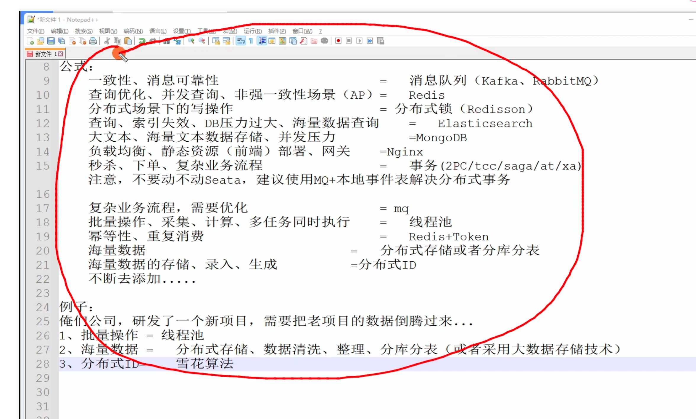

# 常见面试题及答案

## 一、八股文

1、延时队列的原理

DelayQueue是一个基于PriortyQueue的BlockingQueue，他**包装**了 PriortyQueue，他可以根据时间大小来排序任务，这样就可以让时间越小的任务越先执行。

它是J.U.C包下的一个类，是线程安全的。

想要使用这个队列的话，他的元素需要实现Delayed接口，并实现其内的两个方法：

- getDelay `计算该任务距离过期还有多少时间`,

- compareTo `比较、排序使用，用来对延时队列进行比较，时间近的放在队首`

2、红黑树

自平衡二叉查找树，他的结构很复杂，**但有着较良好的最差时间复杂度**，他可以在O(logN)的时间复杂度下完成 查找、删除、增加操作

性质：

- 节点是红色或黑色
- 根节点是黑色的
- 所有叶子结点都是黑色的，且为空节点 NIL
- 每个红色节点的两个子节点都是黑色的
- 从**任一节点**到其**每个叶子**的所有简单路径都包含**相同数目的黑色节点**

3、快速排序

先选中一头的点，然后从两头遍历，将小于它的数值放到它的左边，将大于它的数值放到它的右边。一次循环后会形成一个

小于x的数 x 大于x的数 这样的一个结构。

然后再继续按照这个方式递归来找x左右两侧的数值。

```java
class QuickSort {
    private static void sort(int[] nums) {
        quickSort(nums, 0, nums.length - 1);
    }

    private static void quickSort(int[] nums, int left, int right) {
        if (left >= right) {
            return;
        }

        int i = left, j = right, x = nums[left];
        while (i < j) {
            while (i < j && nums[j] >= x) {
                j--;
            }
            if (i < j) {
                nums[i] = nums[j];
            }
            while (i < j && nums[i] <= x) {
                i++;
            }
            if (i < j) {
                nums[j] = nums[i];
            }
        }

        nums[i] = x;
        quickSort(nums, 0, left - 1);
        quickSort(nums, left + 1, right);
    }
}
```

4、归并排序

```java
class MergeSort {
    /**
     * 自顶向下
     * @param nums
     */
    private static void sort(int[] nums) {
        if (nums == null) {
            return;
        }

        mergeSort(nums, 0, nums.length - 1);
    }

    private static void mergeSort(int[] nums, int left, int right) {
        if (left >= right) {
            return;
        }

        int mid = (left + right) / 2;
        mergeSort(nums, left, mid);
        mergeSort(nums, mid + 1, right);
        merge(nums, left, mid, right);
    }

    /**
     * 合并两个有序数组
     *
     * @param nums
     * @param left
     * @param mid
     * @param right
     */
    private static void merge(int[] nums, int left, int mid, int right) {
        int[] temp = new int[right - left + 1];
        int i = left, j = mid + 1, y = 0;

        while (i <= mid && j <= right) {
            if (nums[i] < nums[j]) {
                temp[y++] = nums[i++];
            } else {
                temp[y++] = nums[j++];
            }
        }

        while (i <= mid) {
            temp[y++] = nums[i++];
        }
        while (j <= right) {
            temp[y++] = nums[j++];
        }

        for (int k = left; k <= right; k++) {
            nums[k] = temp[k - left];
        }
    }

    /**
     * 自底向上
     *
     * @param nums
     */
    private static void sort2(int[] nums) {
        int n = nums.length;
        for (int i = 1; i < n; i *= 2) {
            mergeSort2(nums, n, i);
        }
    }

    private static void mergeSort2(int[] nums, int n, int gap) {
        int i;
        for (i = 0; i + 2 * gap - 1 < n; i += 2 * gap) {
            merge(nums, i, i + gap - 1, i + 2 * gap - 1);
        }
    }
}
```

5、MySQL 常见索引

普通索引：加在一列上，值可以重复

唯一索引：加在一列上，值不可以重复

主键索引：每个表都应该有个主键索引

联合索引：加在多个列上，组成联合索引，使用的时候需要尊 从最左原则

前缀索引：加在 Blob、TEXT和VARCHAR列，只索引开始部分的字符

6、常见索引结构

Hash: 不适合范围检索

B树：非叶节点的内容为 [key, data]的二元组，key表示作为索引的键，data表示索引键所在行的值；每一个节点表示一个值，叶节点不包括已经出现的值。

B+树：在B树的基础上；非叶节点的内容为 key，key为键值，不存储具体内容；在叶子结点之间增加指针，以支持范围索引；叶节点包括所有的值。

7、聚簇索引 & 非聚簇索引

主键索引的B+树的叶节点存储所有字段信息

其他键的索引的叶节点存储主键的值，需要通过主键到主键的B+树再找一次

8、SQL调优

用Explain来分析执行计划，主要的字段有：

- select_type: 查询类型，有简单查询、联合查询、子查询等
- key: 使用的索引
- rows: 扫描的行数

通过慢查询日志来分析，执行速度较慢的SQL

慢查询日志可以通过配置来输出到日志文件里，或直接输出到慢查询表中

可以人工规定执行多久的算慢查询

优化：

- 业务层
  - 减少返回的行数，只取需要的行数，善用分页查询
  - 减少返回的列数，只取需要的字段，不要使用select * 
  - 缓存需要重复使用的值，不要把一些重复的查询放在for循环里
  - 切分大查询
  - 分解大join查询，放到应用程序里做联合操作
- 数据层
  - 合理创建索引：给经常需要查询的列设置索引
  - 索引覆盖查询：给需要查询多个列的设置联合索引
  - 正确使用索引，避免索引失效的情况
- 拆分
  - 如果表的数据过多：可以进行拆分
    - 水平拆分：创建相同的数据库和表，存储相同属性的值
    - 竖直拆分：将经常使用的列，或不经常使用的列，单独拆分出来成一张表
  - 主从复制：读写分离，配置读写分离的主从结构，一个只用于读，这样很少会有锁的情况，可以节省时间。也可以将其存储引擎改为MyISAM，MyISAM比InnoDB读取速度更快。

9、MySQL读写分离 & 主从复制

主从复制涉及三个线程：

- binlog线程：将主服务器的数据变更写到二进制日志中
- I/O线程：负责从主服务器上读取二进制日志，并写入从服务器的中继日志中
- SQL线程：负责读取中继日志中并重放其中的SQL语句

10、MVCC

Multi-Version-Concurrency-Control 多版本并发控制

11、回表

指：聚簇索引的其他索引需要先扫到主键，再根据主键来检索一次

12、索引下推

13、间隙锁、邻间锁、行锁





线上问题排查的时候：

第一时间相应：

1. 确认问题
2. 查看日志
3. 触发报警
4. 回滚操作
5. 保存日志

后续排查：

1. 复现问题
2. 分析日志
3. 使用调试工具
4. 查看监控指标
5. 版本控制和代码审查
6. 与同事协作
7. 优先级划分
8. 修复问题
9. 预防措施





分布式经验 & 高并发经验 场景等等，tmd，不信老子不会了


CAP

Consistency 一致性

Availability 可用性

Partition Tolerance 分区容错性

**三者至多则其二**

微服务技术栈：

|              | netflix | alibaba |
| ------------ | ------- | ------- |
| 注册中心     | eureka  | nacos   |
| 负载均衡     | ribbon  | nginx   |
| 熔断/降级    | hystrix |         |
| 网关         | zuul    | nginx   |
| 接口调用     | feign   | dubbo   |
| 事件消息总线 | bus     |         |
| 分布式事务   |         | seata   |
| 配置中心     | config  | nacos   |

springcloud和dubbo的区别

| 不同         | springcloud | dubbo      |
| ------------ | ----------- | ---------- |
| 服务调用方式 | Rest API    | RPC        |
| 注册中心     | eureka      | zookeeper  |
| 服务网关     | Zuul        | 整合第三方 |
| 断路器       | 支持        |            |

Rest与RPC对比

1. RPC缺陷：服务提供方和调用方式之间的依赖太强，需要对每一个微服务进行接口定义，并通过持续继承发布，严格控制版本。
2. REST是轻量级的接口，服务的提供和调用不存在代码间的耦合，只需要一个约定进行规范。

Eureka

客户端向服务端发送心跳的默认时间为：30秒一次

服务端在等待一定阈值时间未收到客户端心跳的时候，会剔除该服务，默认为：90秒

当客户端一段时间内突然宕机了超过阈值的时候，默认是85%的时候会开启自我保护机制


eureka的自我保护机制：当eureka检测到超过预期的客户端突然终止了链接的时候，会进入自我保护机制，这是为了避免灾难性的网络问题会清除eureka注册表，并且同步给下游，因为下游服务之间的网络可能并没有问题，服务本身也没有问题，这样的话，服务之间就还可以正常调用。

默认情况下，如果在15分钟内超过85%的客户端节点都没有正常的心跳，那么Eureka就认为客户端与注册中心出现了网络故障(比如网络故障或频繁的启动关闭客户端)，Eureka Server自动进入自我保护模式。不再剔除任何服务，当网络故障恢复后，该节点自动退出自我保护模式。

在自我保护机制下，将停止逐出所有实例，

1. 心跳次数高于阈值
2. 自我保护机制被关闭


Consul


Ribbon

根据调用服务服务ID去服务注册中心获取对应的服务列表，并将列表缓存在本地，然后使用配置的负载均衡策略，选择一个可用节点提供服务。

客户端的负载均衡

负载均衡策略：

- 轮询：（默认）
- 随机
- 根据权重轮询


HStrix

1. 服务雪崩
2. 服务熔断
3. 服务降级


SpringCloud Alibaba




目前基本都使用如下结构：




## 二、场景题：



### 案例：

1. 扫码登录怎么实现

2. 订单超时取消

3. 怎么理解接口幂等，项目中如何实现

4. 消息推送中的已读消息和未读消息

5. 布隆过滤器

6. 从B站崩溃的排查过程中能学到什么

7. limit 1000000, 10 加载很慢该怎么优化

8. 会员批量过期方案：200w数量的会员表，每个会员过期时间不一，想在快过期前发送邮件提醒续费，如何实现？

9. 限流算法

10. 一致性Hash （Hash环：Hash之后，就近存储）

11. 秒杀系统设计：过滤90%以上的五小六楼；解决超卖问题

12. 一张一亿数据量的user表，三个字短，userid, username, password怎么设计根据userid和password实现登陆功能；根据userid查询到指定user

13. 1000万数据如何快速导入数据库

14. 一个亿级数据存储问题，每天新增6000万数据

15. 什么情况下会出现fullgc，怎么解决

16. 你有没有做过数据的批量处理？讲一下在分布式的场景下进行数据的导入你如何处理这个 ID 冲突的问题？还是数据导入的场景，你怎么确保大数据量导入的时候不会发生OOM？那如果在生产上确实发生了对数据导入接口的高并发请求而引起了 OOM，你可以从两方面回答我 

    1）你如何判断是哪个对象导致的 OOM 的风险比较大，如何排查？ 

    2）你如何进行 JVM 参数来进行调优？你如何设计这样一个方案： 

    大数据量导出的一个功能，存在多用户并发，可以用 Excel,CVS 做数据载体，如何设计一个下载导出的功能请你从前端交互，后台实现讲讲

17. 生产环境服务器变慢，如何诊断处理？

18. user表进行了分库分表，那么手机号的唯一索引是不是就失效了

19. 在2g的文件中，找出高频top100的单词；如何拆分文件

20. 数据量达到多少的时候要开始分库分表

21. 表数据量大的时候，影响查询效率的主要原因有哪些

22. 如何处理包冲突

23. 分布式下线再上线后如何reblance

24. 如何提升接口性能

25. 对接第三方接口要考虑什么


## 三、算法题

1. 时间轮算法
2. 令牌桶🪣限流算法
3. 滑动窗口算法
4. 雪花算法
5. 跳表
6. 对称加密与非对称加密
7. 敏感数据怎么加解密和传输


## 四、综合题

- 你项目的亮点？你最有成就感的事？最困难的问题？最印象深刻的事情？
  - 解决复杂问题的能力：哪些复杂/有挑战的问题：station事务问题
  - 做了提高效率的工作：重构代码；优化数据库查询效率；引入异步线程；开发了某个公共组件
  - 团队协作/沟通能力：核心开发/小组长；通过管理手段按时完成项目交付；提高了质量

