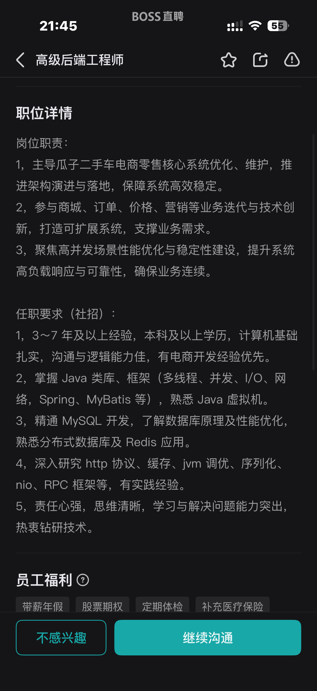

# 瓜子二手车面试准备

## JD

## JD 拆解

## 一、核心结论（先看这个）

这个岗位不是普通业务 CRUD，而是**高并发、高可用、偏交易核心系统**的维护与架构演进。
面试大概率会围绕：**高并发场景下的性能优化、系统稳定性、分布式技术、JVM 调优、MySQL/Redis 深挖**展开。

👉 **你最需要避免的是：只背八股，没有实战场景表达。**

------

## 二、按优先级排序的面试准备内容

### 🔴 第一优先级（几乎必问，且决定是否通过）

#### 1. **高并发场景下的性能优化与稳定性建设**

JD 明确强调：

> 聚焦高并发场景性能优化与稳定性建设，提升高负载响应与可靠性

**准备方向：**

- 你实际遇到过的 **高并发性能问题**（QPS 突然上升、RT 飙高、DB 连接池爆满）
- **限流**（令牌桶、漏桶、Sentinel）、**熔断降级**、**隔离**（线程池/信号量）
- **热点 key 问题**（缓存击穿、穿透、雪崩）及解决方案
- **压测**如何做、如何发现瓶颈

🎯 面试高频题举例：

- “你们系统在双11/大促场景下，怎么保证不挂？”
- “Redis 热点 key 导致某个分片 CPU 100% 怎么办？”

------

#### 2. **JVM 调优与线上问题排查**

JD 提到：jvm调优、序列化、nio

**准备方向：**

- 常见 **GC 算法**与**垃圾收集器**（G1、ZGC 适用场景）
- **OOM、CPU 飙高、频繁 Full GC** 的排查工具（jstat、jmap、MAT、Arthas）
- 典型实战：一次老年代持续增长、Metaspace 泄漏、大对象直接进入老年代
- **序列化**对性能的影响（ProtoBuf vs JSON vs Java 原生）

🎯 面试会问：

- “线上 CPU 突然 100% 怎么定位？”
- “你们的 JVM 参数怎么配置的？为什么？”

------

#### 3. **MySQL 深度 + 分布式数据库**

JD 要求：

> 精通MySQL开发，了解数据库原理及性能优化，熟悉分布式数据库

**准备方向：**

- **索引**：最左前缀、索引下推、覆盖索引、回表、索引失效场景
- **SQL 优化**：慢查询、explain、order by/group by 优化
- **事务隔离级别**（RR vs RC）与 MVCC
- **分布式数据库**（TiDB / ShardingSphere / DRDS）：分片键设计、跨分片查询、分布式事务（不强求很深，但要有认知）

🎯 面试高频：

- “一个 5000 万订单表，如何做分页查询？”
- “分库分表后，怎么处理跨库 join / 全局 ID？”

------

### 🟠 第二优先级（必问，决定深度）

#### 4. **Redis 高可用与复杂场景**

JD：熟悉分布式数据库及Redis应用

**准备方向：**

- 主从、哨兵、Cluster 架构差异及选型
- **持久化**（RDB/AOF）对性能的影响
- 常用数据结构在电商场景的使用（ZSET 做排行榜、Hash 做购物车、分布式锁）
- **Redis 分布式锁**（RedLock 争议、锁续期、可重入）

🎯 容易翻车的问题：

- “Redis 集群中某个节点挂了，数据会丢吗？”
- “如何保证 Redis 缓存和 DB 的最终一致性？”

------

#### 5. **商城 / 订单 / 价格 / 营销业务系统设计**

JD：参与商城、订单、价格、营销等业务迭代与技术创新

**准备方向（结合电商经验）：**

- **订单状态机**设计与并发控制（防止重复下单、超卖）
- **价格系统**：复杂促销叠加（满减、折扣、秒杀价）、计算顺序与扩展性
- **营销**：优惠券的生成、核销、防刷
- **可扩展系统**：策略模式、责任链、配置化

🎯 业务设计题：

- “一个商品同时参加 3 种促销，价格怎么算？”
- “如何设计一个支撑千万级订单的订单服务？”

------

### 🟡 第三优先级（加分 / 差异化）

#### 6. **RPC 框架与 HTTP 协议细节**

JD：深入研究http协议、缓存、RPC框架等

**准备方向：**

- HTTP 1.1 / 2 / 3 核心差异（队头阻塞、多路复用）
- **RPC 原理**（动态代理、序列化、网络通信、负载均衡）
- 对比 Dubbo / gRPC / Feign 的适用场景
- NIO 与 Netty 基础（不必源码级，但要知道 Reactor 模型）

------

#### 7. **系统维护与架构演进（体现经验）**

JD：主导系统优化、维护，推进架构演进

**准备方向（用 STAR 法则准备 1–2 个故事）：**

- 一次从**单体 → 分布式**或**数据库 → 分库分表**的演进
- 一次**核心系统重构**的决策与取舍
- 如何**保障系统高效稳定**（监控、告警、预案、灰度）

------

## 三、面试前最后一晚做什么（重点突击）

✅ **准备 2 个实战案例**（必须能讲 3–5 分钟）：

- 案例1：一次高并发性能优化（从问题发现到解决到数据对比）
- 案例2：一次线上 JVM/MySQL 故障排查

✅ **准备 3 个反问面试官的问题**（体现技术深度）：

- “瓜子二手车在交易高峰期，核心链路的限流和降级策略是怎么设计的？”
- “订单系统目前是否有分库分表？分片键是什么？”
- “团队当前在 JVM 或存储层最大的技术挑战是什么？”

✅ **快速过一遍**：

- JVM GC 日志怎么看
- MySQL explain 字段含义
- Redis 缓存一致性的常见方案

## 着重准备

很好，我们直接进入实战模式。下面我给你 7 个方向，每个方向 1 道最可能的面试真题 + 高分回答思路。
你今晚不用全背，重点是 理解思路 + 能用自己的话讲出关键决策点。

1️⃣ 高并发性能优化
真题：

“你们系统在双11或大促期间，QPS 突然翻倍，接口 RT 从 50ms 飙升到 3s，你怎么排查和解决？”

高分回答思路（按顺序）：

先确认范围（全链路还是单个接口）→ 看监控（APM / 慢接口）

定位瓶颈：

数据库连接池满 → 慢 SQL / 锁

Redis 热点 key → 某个分片 CPU 高

下游 RPC 超时 → 熔断/降级

临时方案（保命）：

限流（Sentinel）、降级非核心功能、热点 key 本地缓存

长期方案：

读写分离、分库分表、异步削峰（MQ）

✅ 加分点：说出“我们实际压测发现，数据库连接池从 50 提到 200 反而更慢，因为上下文切换”。

2️⃣ JVM 调优与线上问题
真题：

“线上 Java 服务突然 CPU 飙到 100%，但流量没有明显增长，你怎么定位？”

高分回答思路：

top -Hp 找到高 CPU 线程 ID

jstack 打印栈，把线程 ID 转十六进制定位到代码行

常见原因：

死循环（while 无退出）

频繁 Full GC（GC 线程忙）

正则 / 序列化热点

真实案例举例：

“有一次是日志里打印大 JSON，toString 触发循环引用，直接打满 CPU”

✅ 加分点：说出你用 Arthas thread -n 快速定位过。

3️⃣ MySQL 深度优化
真题：

“一张 5000 万订单表，按 create_time 分页查询 order by create_time limit 10000, 10 越来越慢，怎么办？”

高分回答思路：

问题本质：大 offset 导致大量扫描

方案一：延迟关联

sql
SELECT * FROM orders 
WHERE id IN (
  SELECT id FROM orders 
  ORDER BY create_time 
  LIMIT 10000, 10
)
方案二：记住上一页最大值（游标分页）
WHERE create_time > last_time LIMIT 10

方案三：分库分表后，改用二级索引 + 业务规避深分页

✅ 加分点：明确说“分页不能只靠数据库，要结合业务，比如只允许翻前 100 页”。

4️⃣ Redis 高可用与缓存一致性
真题：

“先删缓存，再更新数据库，为什么可能还是数据不一致？你怎么解决？”

高分回答思路：

问题复现：

线程 A 删缓存 → 线程 B 读（缓存 miss）→ 线程 B 读旧 DB → 线程 A 更新 DB → 线程 B 把旧数据写回缓存

方案一：延迟双删

先删缓存 → 更新 DB → 休眠 500ms → 再删缓存

方案二：订阅 binlog（Canal）异步删缓存

方案三：串行化（不推荐，性能差）

✅ 加分点：说出“最终一致性可接受，重点防止缓存长时间脏读”。

5️⃣ 订单 / 营销业务设计
真题：

“秒杀场景下，如何防止超卖？不能只依赖数据库行锁。”

高分回答思路：

Redis 预扣库存（Lua 脚本保证原子）

消息队列异步落单，避免 DB 压力

数据库乐观锁：

sql
UPDATE goods SET stock = stock - 1 
WHERE id = ? AND stock > 0
最终一致性：允许短暂超卖，后面退款或补货

✅ 加分点：提到“本地缓存标记库存是否卖完，减少 Redis 压力”。

6️⃣ RPC 与 HTTP 协议
真题：

“你们为什么从 HTTP 换成 RPC？RPC 比 HTTP 强在哪？”

高分回答思路：

HTTP 优势：通用、穿透性强

RPC 优势（内部服务）：

更紧凑的序列化（Protobuf / Hessian）

连接复用、长连接

自带服务发现、负载均衡、熔断

实际案例：

“我们 Dubbo 调用比 HTTP + JSON 同场景 QPS 提升 40%”

✅ 加分点：能说“gRPC 基于 HTTP/2，兼具两者优点”。

7️⃣ 系统架构演进（体现经验）
真题：

“如果让你把一个单机订单系统改成支撑千万级流量，你第一步会做什么？”

高分回答思路（不要一上来就分库分表）：

第一步：拆分数据库与 Web 分离

第二步：加 Redis 缓存（热点数据）

第三步：读写分离

第四步：垂直拆分（订单与商品服务分离）

第五步：水平分库分表（最后手段）

✅ 加分点：说出“每步都要有可回滚方案，先保证业务连续”。

## 面试复盘

