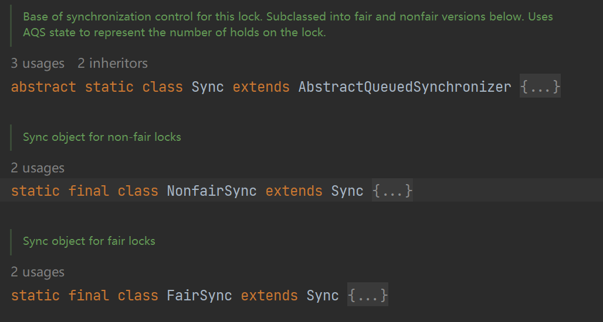

# AQS

> AbstractQueuedSynchronizer
>
> AQS = state变量 + CLH变种的双端队列


## 1 source code

```Java
// The synchronization state.
private volatile int state;
```

Source code of Node

```java
static final class Node {
    // SHARED：线程以共享模式等待锁；EXCLUSIVE：线程以独占模式等待锁
    static final Node SHARED = new Node();
    static final Node EXCLUSIVE = null;

    static final int CANCELLED =  1;
    static final int SIGNAL    = -1;
    static final int CONDITION = -2;

    static final int PROPAGATE = -3;

    /**
    * 当前节点在队列中的状态:
    *   默认值: 0
    *   CANCELLED: 示线程获取锁的请求取消了
    *   CONDITION: 表示节点在等待队列中，等待唤醒
    *   PROPAGATE: 为SHARED模式下，才会使用此字段
    */
    volatile int waitStatus;

    volatile Node prev;
    volatile Node next;

    volatile Thread thread;

    Node nextWaiter;

    final boolean isShared() {
        return nextWaiter == SHARED;
    }

    final Node predecessor() throws NullPointerException {
        Node p = prev;
        if (p == null)
            throw new NullPointerException();
        else
            return p;
    }

    Node() {    // Used to establish initial head or SHARED marker
    }

    Node(Thread thread, Node mode) {     // Used by addWaiter
        this.nextWaiter = mode;
        this.thread = thread;
    }

    Node(Thread thread, int waitStatus) { // Used by Condition
        this.waitStatus = waitStatus;
        this.thread = thread;
    }
}
```

## 2 ReenTrantLock



公平锁与非公平锁的 `tryAcquire()`方法的唯一区别就是，公平锁多了一部判断

```Java
if (!hasQueuedPredecessors() &&
```

公平锁即当当前锁的等待队列中已经有排队线程的时候，则将当前线程入队列，等待之后获取到锁

非公平锁在线程获取到锁资源的时候不管有没有等待队列，会立刻去执行

## 3 source-code-analysis

枷锁过程：

- 尝试加锁
- 加锁失败，进入等待队列
- 线程入队列后，进入阻塞状态


