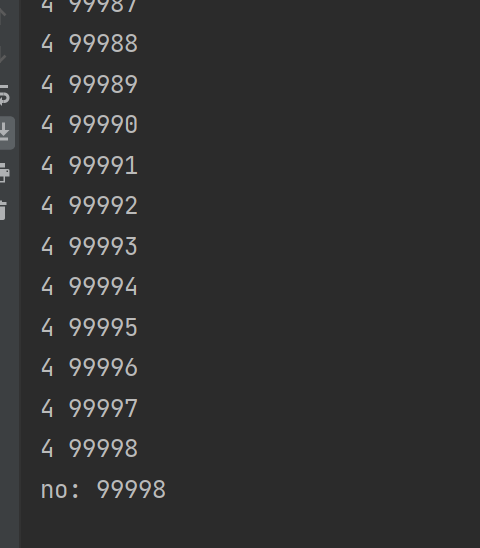

# Volatile

## 1 重排序

在Java中，为了程序的性能考虑，Java在实际执行的时候代码顺序和编写的顺序有可能不同，比如下面这一小段

```java
int a = 1;
int b = 2;
int c = a + b;
```

其中第1、2行彼此间没有什么关系，所以解释器实际执行的时候可以选择对这两句进行**重排序**，但重排序的结果不能影响程序的正确运行，在本例中即不能影响c的值，因为c依赖a、b， 1、2两行如何交换，c的值都应该是3。但是**重排序不影响程序的运行结果**这个结论是在单线程的基础上的。

在多线程中，Java并没有做什么特殊处理依然会进行重排序操作，这样就会带来一些问题。而Java将处理重排序的操作放给了程序员，即向用户提供了 volatile修饰符和各种锁。

### 1.1 重排序在多线程中的问题

如下一段代码，在多线程情况下执行的时候，有可能因为重排序产生问题。

```java
class TestVolatile {
    int a = 1;
    boolean flag = false;
	
    public void run() {
        a = 2;
        flag = true;
        if (flag) {
            System.out.println(a);
        }
    }
}
```

输出结果有可能为：1 ，实际中多次测试（小于100次）发现并没有出现重排序的情况，猜测为Java的优化

## 2 原子性

老生常谈：原子性即“要么全部执行成功，要么全部失败”，关于原子性最经典的例子就是“a给b转账1000块”这应该是一个原子操作，a-1000; b+1000; 不能出现a-1000成功了，b+1000失败了的情况。

而在Java中，只有简单的基础类型赋值才是天然的原子性操作如： int i = 1; j = 3;

其他如变量赋值操作: i = j，运算操作 i = i + 2，ClassA a = classB; 等都不是原子操作；

其中最经典的案例即：`i++`

### 2.1 原子性问题

在原子性问题中最多被用来举例子的就是i++操作

```java
i++;  // 可以分解为：get(i); i+1; set(i) 三步操作
```

此时如果有两个线程来运行此加加操作的话，预期结果是i==3，而实际有可能出现如下情景导致结果不正确。

```java
ThreadA: get(i);
ThreadB: get(i);
ThreadB: i+1;
ThreadA: i+1;
ThreadA: set(i);
ThreadB: set(i);
```

最终i的值**并不是 3 而是2**

代码示例：

```java
public class VolatileStudy {
    int no = 0;
    private void inc() {
        no++;
    }

    public static void main(String[] args) {
        VolatileStudy study = new VolatileStudy();
        for (int i = 0; i < 10; i++) {
            new Thread(() -> {
                for (int j = 0; j < 10000; j++) {
                    study.inc();
                    System.out.println(Thread.currentThread().getName() + " " + study.no);
                }
            }, String.valueOf(i)).start();
        }

        try {
            TimeUnit.SECONDS.sleep(5);
        } catch (InterruptedException e) {
            throw new RuntimeException(e);
        }
        System.out.println("no: " + study.no);
    }
}
```

在实际的测试中，多次（小于100）测试中出现次数较多，约为1/3



## 3 可见性

要聊可见性就要先聊聊JMM，即Java Memory Model，译过来为Java内存模型，用来描述Java线程中内存模型，这是一个逻辑概念并不对应实际的物理内存分布。

而要聊JMM则要先了解下CPU内存模型（操作系统，CPU等等有很多值得好好学习的知识点，很多其他领域都是参考操作系统和硬件处理的）

当我们运行了一个程序的时候，操作系统将**硬盘**（就是我们常说的我电脑有500g有1t的空间）中的数据加载到**内存**中去供CPU或其他如GPU进行处理，为什么要将硬盘中的数据加载到内存中去呢？这是因为硬盘的io很慢，而cpu的处理速度很快，cpu需要去等待数据的io操作。于是就好像在mysql上加一层redis一样我们也在cpu和硬盘中间加了一层io速度更快的内存（也就是我们常说的内存条，8g,16g,32g,64g等等）。即使是这样，内存的io速度与cpu的处理速度依然差距很大，于是又在内存和cpu中间加了几层**高速缓存**。cpu通过读取高速缓存中的数据进入到自己的**寄存器**（可以理解为cpu自带了一部分内存，io速度极快但空间很小）中处理后再写回主存中去。

这样一来cpu就解决了内存io速度太慢的问题，但同时也带来了新的问题，即：数据一致性问题。

如果cpu是线性串行的运行那不会有什么问题，读取数据，处理数据，存储数据即可。

但实际上cpu是多线程在运行的，各个核心各个线程从主存中取到数据放到自己的高速缓存中去，再从高速缓存中读取数据放到自己的寄存器中去做处理，再在一个合适的时间写回到主存中，那么当多个线程取到了同一个数据，放到高速缓存中去，a线程执行操作了之后，b线程缓存中依然是之前的数据，会继续对旧数据进行处理，处理完写回主存的时候，就会导致数据冲突。

为什么要说cpu的内存模型呢，是因为JMM和他很像，Java在线程中也设置了一个本地内存，即线程内部的内存，线程从主存中取到数据放到本地内存中处理后再写回主存中。那么就也会出现上面提到的数据一致性问题。

## 4 解决

volatile （易挥发的，波动的）

为了解决以上提到的 **重排序**问题和**可见性**问题Java提供了volatile修饰符

volatile修饰符只能用来修饰变量，并达到如下两个功能：

1. volatile修饰的变量在执行相关操作的时候，不进行重排序
2. volatile修饰的变量在发生变化之后会立刻写回主内存中，并将其他线程中的缓存值设为失效，即让其他线程去主存中重新读取最新的值

### 4.1 解决重排序问题

volatile通过内存屏障（Memory Barriers）来避免重排序问题

我们先来看一段代码

```java
import java.util.concurrent.atomic.AtomicInteger;

class HelloWorld {

	static volatile int i = 1;

    public static void main(String[] args) {
		i++;
		System.out.println(i);
    }
}
```

在这段代码中我们对一个使用volatile修饰的整型进行了加加操作，并输出他

这是这段代码的汇编代码

```shell
PS F:\workspace\java\text> javac .\HelloWorld.java
PS F:\workspace\java\text> javap -l -c HelloWorld
Compiled from "HelloWorld.java"
class HelloWorld {
  static volatile int i;

  HelloWorld();
    Code:
       0: aload_0
       1: invokespecial #1                  // Method java/lang/Object."<init>":()V
       4: return
    LineNumberTable:
      line 3: 0

  public static void main(java.lang.String[]);
    Code:
       0: getstatic     #2                  // Field i:I
       3: iconst_1
       4: iadd
       5: putstatic     #2                  // Field i:I
       8: getstatic     #3                  // Field java/lang/System.out:Ljava/io/PrintStream;
      11: getstatic     #2                  // Field i:I
      14: invokevirtual #4                  // Method java/io/PrintStream.println:(I)V
      17: return
    LineNumberTable:
      line 8: 0
      line 9: 8
      line 10: 17

  static {};
    Code:
       0: iconst_1
       1: putstatic     #2                  // Field i:I
       4: return
    LineNumberTable:
      line 5: 0
}
```


### 内存屏障（Memory Barrier）

内存屏障分为

读屏障 (Load)：强迫线程到主存中读取变量最新的值

写屏障(Store)：强迫线程将变量值写回到主存中去


这两个屏障可以进行组合以起到更丰富的功能

| 屏障类型   | 屏障功能 |
| ---------- | -------- |
| LoadLoad   |          |
| LoadStore  |          |
| StoreLoad  |          |
| StoreStore |          |


## 5 但这样并不能解决原子性问题

volatile需要其他的方法来配合实现原子性，这个可以直接使用各种锁，也可以使用一个方式：cas


