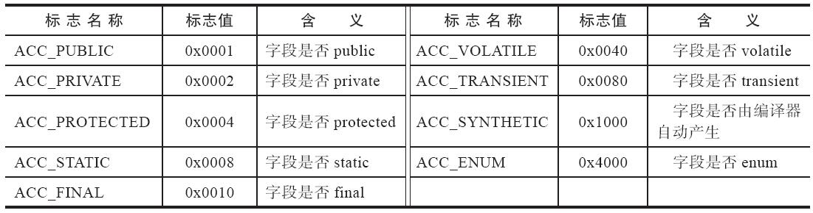

# JVM-study

## 1 Java运行时内存：

​	程序计数器，虚拟机栈，本地方法栈：随线程生灭

​	堆，方法区：不确定性：使用内存大小不确定

## 2 垃圾收集

### 2.1 who

> 判断要收集哪些对象，即判断哪些对象已死

#### 2.1.1 引用计数算法(Reference Counting)

> COM技术，FlashPlayer，Python，Squirrel

给对象添加一个引用计数器，每当一个地方引用它时，则计数器加一；当引用失效时，计数器减一，当计数器为0则判断对象已死。

需要配合额外处理才能判定对象确实死亡，比如无法解决对象之间的循环引用问题

#### 2.1.2 可达性分析算法(Reachability Analysis)

> Java，C#，Lisp

通过从GC Roots开始根据引用关系向下搜索，搜索过程所走的路称为“引用链”，如果某个对象到GC Roots间没有任何**引用链**相连，即从GC Roots到该对象不可达时，判断该对象已死

GC Roots：

- 虚拟机栈中引用的对象：各线程被调用的方法堆栈中使用到的参数、局部变量、临时变量等
- 方法区中静态属性引用的对象：Java类的引用类型静态变量
- 方法区中常量引用的对象：字符串常量池中的引用
- 本地方法栈中JNI引用的对象
- Java虚拟机内部的引用：基本数据类型对应的Class对象，一些常驻的异常对象，系统加载类
- 所有被同步锁持有的对象
- 反映Java虚拟机内部情况的JMXBean、JVMTI中注册的回调、本地代码缓存

#### 2.1.3 再谈引用：

jdk1.2之前引用的概念为：如果reference类型的数据中存的数值代表的是另外一块内存的起始地址，就称该reference数据是代表某块内存、某个对象的引用。

jdk1.2之后对引用进行了扩充：强引用，软引用，弱引用，虚引用。

强引用：有用，不会被回收掉

软引用：有用但非必须，当系统将要发生内存溢出异常前，会进行第二次回收回收这些对象

弱引用：非必须对象，下次垃圾收集会被收集掉，不管内存是否够

虚引用：虚引用不会影响对象的生存时间，只是为了在对象被收集时收到一个系统通知

### 2.2 how

 垃圾收集算法 

#### 2.2.1 分代收集理论

> 弱分代假说：绝大多数对象是朝生夕灭的
>
> 强分代假说：熬过越多次垃圾收集过程的对象越难以消亡

Minor GC; Major GC; Full GC

标记-复制算法；标记-清除算法；标记-整理算法

分代：新生代(Young Generation)；老年代(Old Generation)

问题：对象之间 跨代引用

解决跨代引用：

> 跨代引用假说：跨代引用相对于同代引用来说仅占极少数

名词：

Partial GC 部分收集

Minor GC 新生代收集

Major GC 老年代收集

Mixed GC 混合收集

Full GC 整堆收集

#### 2.2.6 CMS收集器

运行过程：

1. 初始标记 Stop The World 标记GC Roots能直接关联到的对象，速度很快
2. 并发标记 从GC Roots直接关联对象开始遍历整个对象图，耗时较长但不需要停顿用户线程
3. 重新标记 Stop The World 修正并发标记期间用户线程依然运行产生的变动
4. 并发清除 清理掉标记死亡的对象

缺点:

### 2.3 分配规则

#### 2.3.1 对象优先分配在Eden区

```java
// 使用serial垃圾收集器；分配最小内存20M最大内存20M；打印垃圾收集器详细信息；Eden区与survivor区比例8:1
-verbose:gc -XX UseSerialGC -Xms20M -Xmx20M -Xmn10M -XX:+PrintGCDetails -XX:SurvivorRatio=8
```

```java
package com.wx.test;

/**
 * @Descrption:
 * @Author: x43125
 * @Date: 21/10/03
 */
public class TestAllocation {
    private static final int _1Mb = 1024 * 1024;

    public static void main(String[] args) {
        testAllocation();
    }

    /**
     * -verbose:gc -Xms20M -Xmx20M -Xmn10M -XX:+PrintGCDetails -XX:SurvivorRatio=8
     */
    public static void testAllocation() {
        byte[] allocation1, allocation2, allocation3, allocation4;
        allocation1 = new byte[2 * _1Mb];
        allocation2 = new byte[2 * _1Mb];
        allocation3 = new byte[2 * _1Mb];
        allocation4 = new byte[4 * _1Mb];
    }
}
```

#### 2.3.2 大对象直接进入老年代

```java
//  使用serial垃圾收集器；分配最小内存20M最大内存20M；打印垃圾收集器详细信息；Eden区与survivor区比例8:1；大于3145728的对象直接分配到old区
-verbose:gc -XX:+UseSerialGC -Xms20M -Xmx20M -Xmn10M -XX:+PrintGCDetails -XX:SurvivorRatio=8 -XX:PretenureSizeThreshold=3145728
```

```java
package com.wx.test;

/**
 * @Descrption:
 * @Author: x43125
 * @Date: 21/10/03
 */
public class TestAllocation {
    private static final int _1Mb = 1024 * 1024;

    public static void main(String[] args) {
        testPretenureSizeThreshold();
    }

    /**
     * -verbose:gc -XX:+UseSerialGC -Xms20M -Xmx20M -Xmn10M -XX:+PrintGCDetails -XX:SurvivorRatio=8 -XX:PretenureSizeThreshold=3145728
     */
    public static void testPretenureSizeThreshold() {
        byte[] allocation = new byte[4 * _1Mb];
    }
}

```

#### 2.3.3 长期存活的对象进入老年代

对象年龄(Age):

对象一般出生在Eden区，如果一次MinorGC后对象仍存活，并且survivor区能够容纳的话，将会被存放在survivor区，并将年龄设为1岁，对象在survivor中每熬过一次MinorGC，年龄就+1，当年龄到达一定程度后（默认15）就会被转移到老年代中。转移阈值设定参数：`-XX: MaxTenuringThreshold`

```java
package com.wx.test;

/**
 * @Descrption:
 * @Author: x43125
 * @Date: 21/10/03
 */
public class TestTenuringThreshold {
    private static final int _1Mb = 1024 * 1024;

    public static void main(String[] args) {
        testTenuringThreshold();
    }

    /**
     * -verbose:gc -XX:+UseSerialGC -Xms20M -Xmx20M -Xmn10M -XX:+PrintGCDetails -XX:SurvivorRatio=8 -XX:MaxTenuringThreshold=1
     */
    public static void testTenuringThreshold() {
        byte[] allocation1, allocation2, allocation3, allocation4;
        allocation1 = new byte[_1Mb / 4];

        allocation2 = new byte[4 * _1Mb];
        allocation3 = new byte[4 * _1Mb];
        allocation3 = null;
        allocation3 = new byte[4 * _1Mb];
    }
}
```

```java
// jvm参数：
-verbose:gc -XX:+UseSerialGC -Xms20M -Xmx20M -Xmn10M -XX:+PrintGCDetails -XX:SurvivorRatio=8 -XX:MaxTenuringThreshold=1
// 结果
[GC (Allocation Failure) [DefNew: 6075K->880K(9216K), 0.0043730 secs] 6075K->4976K(19456K), 0.0044142 secs] [Times: user=0.00 sys=0.02, real=0.00 secs] 
[GC (Allocation Failure) [DefNew: 4976K->0K(9216K), 0.0012099 secs] 9072K->4973K(19456K), 0.0012513 secs] [Times: user=0.00 sys=0.00, real=0.00 secs] 
Heap
 def new generation   total 9216K, used 4178K [0x00000000fec00000, 0x00000000ff600000, 0x00000000ff600000)
  eden space 8192K,  51% used [0x00000000fec00000, 0x00000000ff014930, 0x00000000ff400000)
  from space 1024K,   0% used [0x00000000ff400000, 0x00000000ff400000, 0x00000000ff500000)
  to   space 1024K,   0% used [0x00000000ff500000, 0x00000000ff500000, 0x00000000ff600000)
 tenured generation   total 10240K, used 4973K [0x00000000ff600000, 0x0000000100000000, 0x0000000100000000)
   the space 10240K,  48% used [0x00000000ff600000, 0x00000000ffadb4b8, 0x00000000ffadb600, 0x0000000100000000)
 Metaspace       used 3287K, capacity 4496K, committed 4864K, reserved 1056768K
  class space    used 357K, capacity 388K, committed 512K, reserved 1048576K
```

```java
// jvm参数
-verbose:gc -XX:+UseSerialGC -Xms20M -Xmx20M -Xmn10M -XX:+PrintGCDetails -XX:SurvivorRatio=8 -XX:MaxTenuringThreshold=15
// 结果
[GC (Allocation Failure) [DefNew: 6075K->856K(9216K), 0.0042641 secs] 6075K->4952K(19456K), 0.0043084 secs] [Times: user=0.00 sys=0.00, real=0.00 secs] 
[GC (Allocation Failure) [DefNew: 5036K->0K(9216K), 0.0012283 secs] 9132K->4948K(19456K), 0.0012557 secs] [Times: user=0.00 sys=0.00, real=0.00 secs] 
Heap
 def new generation   total 9216K, used 4316K [0x00000000fec00000, 0x00000000ff600000, 0x00000000ff600000)
  eden space 8192K,  52% used [0x00000000fec00000, 0x00000000ff0372c0, 0x00000000ff400000)
  from space 1024K,   0% used [0x00000000ff400000, 0x00000000ff4000d0, 0x00000000ff500000)
  to   space 1024K,   0% used [0x00000000ff500000, 0x00000000ff500000, 0x00000000ff600000)
 tenured generation   total 10240K, used 4948K [0x00000000ff600000, 0x0000000100000000, 0x0000000100000000)
   the space 10240K,  48% used [0x00000000ff600000, 0x00000000ffad5298, 0x00000000ffad5400, 0x0000000100000000)
 Metaspace       used 3287K, capacity 4496K, committed 4864K, reserved 1056768K
  class space    used 357K, capacity 388K, committed 512K, reserved 1048576K
```

#### 2.3.4 动态对象年龄判定

> 如果Survivor空间中相同年龄所有对象大小的总和大于Survivor空间的一半，年龄大于或小于该年龄的对象就可以直接进入老年代

```java
package com.wx.test;

/**
 * @Descrption:
 * @Author: x43125
 * @Date: 21/10/03
 */
public class TestTenuringThreshold {
    private static final int _1Mb = 1024 * 1024;

    public static void main(String[] args) {

        testTenuringThreshold2();
    }
    /**
     * -verbose:gc -XX:+UseSerialGC -Xms20M -Xmx20M -Xmn10M -XX:+PrintGCDetails -XX:SurvivorRatio=8 -XX:MaxTenuringThreshold=15 -XX:+PrintTenuringDistribution
     */
    public static void testTenuringThreshold2() {
        byte[] allocation1, allocation2, allocation3, allocation4;
        // allocation1+allocation2大于survivor空间一半
        allocation1 = new byte[_1Mb / 4];
        allocation2 = new byte[_1Mb / 4];
        allocation3 = new byte[4 * _1Mb];
        allocation4 = new byte[4 * _1Mb];
        allocation4 = null;
        allocation4 = new byte[4 * _1Mb];
    }
}
```


```Java
// jvm参数
-verbose:gc -XX:+UseSerialGC -Xms20M -Xmx20M -Xmn10M -XX:+PrintGCDetails -XX:SurvivorRatio=8 -XX:MaxTenuringThreshold=15 -XX:+PrintTenuringDistribution
    
// 结果
[GC (Allocation Failure) [DefNew
Desired survivor size 524288 bytes, new threshold 1 (max 15)
- age   1:     902120 bytes,     902120 total
: 6075K->880K(9216K), 0.0045611 secs] 6075K->4976K(19456K), 0.0046855 secs] [Times: user=0.00 sys=0.00, real=0.00 secs] 
[GC (Allocation Failure) [DefNew
Desired survivor size 524288 bytes, new threshold 15 (max 15)
: 4976K->0K(9216K), 0.0012101 secs] 9073K->4973K(19456K), 0.0012396 secs] [Times: user=0.00 sys=0.00, real=0.00 secs] 
Heap
 def new generation   total 9216K, used 4178K [0x00000000fec00000, 0x00000000ff600000, 0x00000000ff600000)
  eden space 8192K,  51% used [0x00000000fec00000, 0x00000000ff014930, 0x00000000ff400000)
  from space 1024K,   0% used [0x00000000ff400000, 0x00000000ff400000, 0x00000000ff500000)
  to   space 1024K,   0% used [0x00000000ff500000, 0x00000000ff500000, 0x00000000ff600000)
 tenured generation   total 10240K, used 4973K [0x00000000ff600000, 0x0000000100000000, 0x0000000100000000)
   the space 10240K,  48% used [0x00000000ff600000, 0x00000000ffadb580, 0x00000000ffadb600, 0x0000000100000000)
 Metaspace       used 3287K, capacity 4496K, committed 4864K, reserved 1056768K
  class space    used 357K, capacity 388K, committed 512K, reserved 1048576K
```

## 3 类文件结构

> 以Class文件为媒介；各种不同的语言转换成Class文件，虚拟机并不关心Class文件的来源，他只会按照事先规定好的规范来执行Class文件。

### 3.1 Class类文件的结构

> 任何一个Class文件都对应着唯一的一个类或接口的定义信息（但类或接口不一定必须定义在文件中：可以动态生成再送入类加载器中）

Class文件是一组以8个字节为基础单位的二进制流，各数据项目严格按照顺序排列，中间没有任何分隔符

#### 3.1.1 魔数与Class文件的版本

Class文件头4个字节 -- 魔数(Magic Number)，用来确定这个文件是否为能被虚拟机接受的Class文件

Class文件魔数为：0xCAFEBABE

第5第6字节为次版本号(Minor Version)

第7第8为主版本号(Major Version)

Java的版本号从45开始，高版本可以兼容低版本，低版本不能运行高版本Class


上测为通过WinHex软件打开的一段Java代码的Class文件，代码如下

```java
package com.wx.test;

/**
 * @Descrption:
 * @Author: x43125
 * @Date: 21/10/10
 */
public class StudyClass {
    private int m;

    public int inc() {
        return m+1;
    }
}

```

#### 3.1.2 常量池

紧接着主次版本号之后的就是常量池入口

如上侧展示为0x0016即22，常量池的容量技术是从1开始的，所以此处即表示：**常量池中有22项常量**，范围为1~22

0表示：不引用任何一个常量池项目

常量池：字面量(Literal)，符号引用(Symbolic References)

字面量：Java层面的常量，如文本字符串，final修饰的常量值

符号引用：编译原理方面概念，主要包括以下几类常量

- 被模块导出或开放的包
- 类和接口的全限定名
- 字段的名称和描述符
- 方法的名称和描述符
- 方法句柄和方法类型
- 动态调用点和动态常量

> Java代码在进行Javac编译时，不像C和C++有“连接”这一步，而是在虚拟机加载Class文件时进行动态连接。
>
> 也就是说，Class文件中不会保存各个方法、字段最终在内存中的布局信息。
>
> 这些字段、方法的符号引用不经过虚拟机在“运行期转换”的话是无法得到真正的内存入口地址，也就无法直接被虚拟机使用。

紧接着即是实际的常量：

此处使用书中案例：与我的环境有所不同

**上面代码的class文件的winhex查看内容:**


**常量池项目类型：**


第一个常量：0x07，通过查表可知其为CONSTANT_Class_info，结构如下


tag为标志位，用于区分常量类型

name_index是常量池索引值，指向常量池中一个CONSTANT_Utf8_info类型常量，代表了这个类（或接口）的全限定名

此处name_index值为0x0002即指向了常量池中第二项常量，从图中可见第二项常量为0x01，查表可知其确实为一个CONSTANT_Utf8_info类型常量，其结构为：


length表示这个UTF-8编码的字符串长度是多少字节，他后面紧跟着的长度为length字节的连续数据是一个使用UTF-8缩略编码表示的字符串。当前length值为0x001D即之后29个字节表示全限定类名

**常量池中17种数据类型结构总表**


根据这些结构表即可以通过查看class文件查看到原先代码的秘密

#### 3.1.3 访问标志

常量池结束紧跟的**2个字节**代表访问标志(access_flags)


当前只定义了其中9种

#### 3.1.4 类索引、父类索引与接口索引集合

类索引：确定类全限定名：CONSTANT_Class_info

父类索引：除了java.lang.Object外所有类父类索引都不为0，但只有一个: CONSTANT_Class_info

接口索引集合：实现了哪些接口

#### 3.1.5 字段表集合

字段表(filed_info)：接口或类中声明的变量

包括类级变量，实例级变量，**不包括**方法内的局部变量

**字段表结构**


**字段访问标志**



**描述符标识字符含义**


#### 3.1.6 方法表集合

**方法表结构**


**方法访问标志**


