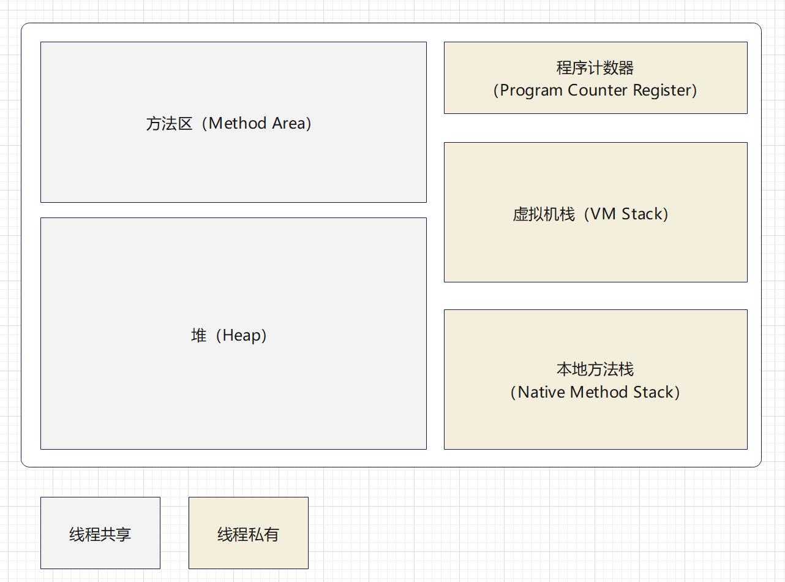

# Jvm Study Quick Note

## 1 内存区域

## 1.1程序计数器

> Program Counter Register

  程序计数器是**线程私有**的；用于指示当前线程运行到哪个位置，1. 用于在各种循环、if等判断分支中指示接下来的运行语句；2. 用于在多线程切换后指定接着运行的线程的开始运行位置。

  程序计数器是唯一一个不会发生**OOM**的区域。

### 1.2 虚拟机栈

> Java Virtual Machine Stack

  线程私有；Java**方法执行**的线程内存模型；每个方法被执行的时候，JVM都会创建一个**栈帧(Stack Frame)**;用于存储方法执行的**局部变量表、操作数栈、动态连接、方法出口**等信息；每个栈帧在虚拟机栈中从**入栈到出栈**的过程即对应一个方法被**调用到执行**完毕的过程。

#### 1.2.1 局部变量表

1. 存放

    - 编译期可知的各种Java虚拟机基本数据类型（boolean, byte, char, short, int, float, long, double）

    - returnAddress类型（指向了一条字节码指令的地址）

    - 对象引用（不等同于对象本身，可能是一个指向对象起始地址的引用地址；或是指向一个代表对象的句柄；再或是其他与此对象相关的位置）

2. 局部变量槽(Slot)：long和double (64位长度)的数据占用两个slot，其他的占用1个

3. 局部变量表所需的内存空间在编译期间完成分配（当进入一个方法时，这个方法对应栈帧在局部变量空间中分配多少内存是 **完全确定**的）

4. 异常：

    1. 当线程请求的栈深度大于虚拟机允许的深度：**StackOverflowError异常**；（递归调用未正常退出）
    2. 如果JVM虚拟机栈容量可以动态扩展，当扩展到无法申请到足够的内存时：**OutOfMemoryError异常**；(HotSport虚拟机的栈容量不可以动态扩展)

#### 1.2.2 操作数栈

#### 1.2.3 动态连接

#### 1.2.4 方法出口

### 1.3 本地方法栈

> Native Method Stacks

和虚拟机栈相似，只是运行的为本地（Native）方法服务；

HotSpot 虚拟机将 虚拟机栈和本地方法栈 **合二为一** 了

异常：StackOverflowError异常；OutOfMemoryError异常

### 1.4 堆

> Heap

内存中最大的一块

