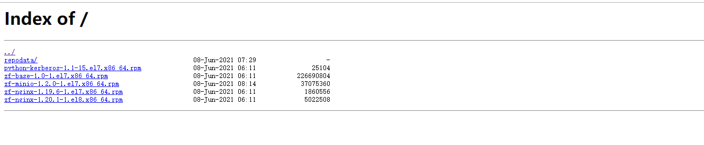

# centos7 yum源制作

> 自制yum源，以供内部使用

### 1 准备

#### 1.1 服务器需求

一台外网服务器，用于制作下载yum源相关依赖

两台内网服务器，一台作为yum源，另一台模拟使用此yum源

#### 1.2 基础依赖

```sh
# 根据个人服务器版本选择，centos7选择el7
zf-nginx-1.19.6-1.el7.x86_64.rpm
# centos8选择el8
zf-nginx-1.20.1-1.el8.x86_64.rpm
# 本文使用centos7为例
```

#### 1.3 系统准备

##### 关防火墙

```sh
systemctl status firewalld
# 若为active，则需关闭
# 关闭
systemctl stop firewalld
# 关闭开机自启
systemctl disable firewalld
```

##### 最小化安装

### 2 搭建

#### 2.1 外网服务器

首先在外网设备上下载制作一系列依赖

##### 2.1.1 创建基础依赖包存放文件夹

```sh
mkdir /opt/depend
```

##### 2.1.2 下载所需的资源包

使用以下命令将最主要的依赖`createrepo`下载到基础依赖包文件夹中，其他**所有**需要的资源如 Java，python 等基础依赖酌情下载

```sh
# createrepo为制作yum源的关键，必须下载！！！
yum install --downloadonly createrepo --downloaddir=/opt/depend
yum install --downloadonly python3 --downloaddir=/opt/depend/
yum install --downloadonly Java --downloaddir=/opt/depend/
......

ll /opt/depend
total 63284
-rw-r--r--. 1 root root    95840 Aug 10  2017 createrepo-0.9.9-28.el7.noarch.rpm
-rw-r--r--. 1 root root    83984 Jul  3  2014 deltarpm-3.6-3.el7.x86_64.rpm
-rw-r--r--. 1 root root   316928 Apr 22 08:50 java-1.8.0-openjdk-1.8.0.292.b10-1.el7_9.x86_64.rpm
-rw-r--r--. 1 root root 10313352 Apr 22 08:50 java-1.8.0-openjdk-devel-1.8.0.292.b10-1.el7_9.x86_64.rpm
-rw-r--r--. 1 root root 34614932 Apr 22 08:50 java-1.8.0-openjdk-headless-1.8.0.292.b10-1.el7_9.x86_64.rpm
-rw-r--r--. 1 root root    91396 Aug 22  2019 libtirpc-0.2.4-0.16.el7.x86_64.rpm
-rw-r--r--. 1 root root   253008 Oct 14  2020 libxml2-python-2.9.1-6.el7.5.x86_64.rpm
-rw-r--r--. 1 root root  8360316 Feb  3 11:48 perl-5.16.3-299.el7_9.x86_64.rpm
-rw-r--r--. 1 root root   706128 Feb  3 11:48 perl-libs-5.16.3-299.el7_9.x86_64.rpm
-rw-r--r--. 1 root root    71844 Nov 18  2020 python3-3.6.8-18.el7.x86_64.rpm
-rw-r--r--. 1 root root  7286976 Nov 18  2020 python3-libs-3.6.8-18.el7.x86_64.rpm
-rw-r--r--. 1 root root  1702324 Oct 14  2020 python3-pip-9.0.3-8.el7.noarch.rpm
-rw-r--r--. 1 root root   644052 Aug 22  2019 python3-setuptools-39.2.0-10.el7.noarch.rpm
-rw-r--r--. 1 root root    32084 Jul  4  2014 python-deltarpm-3.6-3.el7.x86_64.rpm
```

如果有事先准备好的rpm包需要安装，可以使用以下命令来检查此rpm包的依赖，如果有缺少依赖会打印出来，再下载到基础依赖包文件夹中 **(未经验证）**

```sh
yum install --downloadonly --downloaddir=/opt/depend your.rpm
```

##### 2.1.3 打包基础依赖包文件夹上传服务器

将基础依赖包文件夹`depend`打包上传到将用来作为**yum源服务器**的机器上

```sh
tar zcvf depend.tar.gz /opt/depend
# 将depend.tar.gz上传到yum源服务器上
```

#### 2.2 内网yum源服务器

##### 2.2.1 解压

将上传上来的`depend.tar.gz`解压到`/opt`目录下

```sh
tar -zxvf depend.tar.gz -C /opt
```

##### 2.2.2 创建仓库repository

- 安装`createrepo`

```sh
yum install -y /opt/depend/createrepo
```

- 创建repository仓库

本文将创建两个仓库，一个仓库为基础依赖包文件夹`depend`，另一个为zfbdp的组件包`zfbdp-rpms`

```sh
createrepo /opt/depend
# 将zfbdp所有组件放到/opt/zfbdp-rpms文件夹中
mkdir /opt/zfbdp-rpms
mv rpms路径/* /opt/zfbdp-rpms
createrepo /opt/zfbdp-rpms
```

> 每一个仓库，均需做此一步

##### 2.2.3 yum源配置

- 备份本地的repo  

```sh
cd /etc/yum.repos.d
mkdir /bak
# 报警忽略
mv ./* ./bak
```

- 创建repo

以后每添加一个仓库都需要再此创建一个对应的repo，现在我们有两个基础依赖包仓库，现在我们为这两个仓库做yum源映射配置

```sh
# 在 os-depend.repo 中添加以下内容，即将/opt/depend映射成仓库，以后就可以直接通过yum install下载此文件夹下的文件了
vi os-depend.repo
[depend]
name=depend
baseurl=file:///opt/depend
gpgcheck=0

vi zfbdp.repo
[zfbdp]
name=zfbdp
baseurl=file:///opt/zfbdp-rpms
gpgcheck=0
```

- 清除 yum缓存，删除yum缓存目录，创建新的yum缓存

```sh
yum clean all
rm -rf /var/cache/yum/*
# 如果设置错误，此步会报错，须仔细检查，主要为2.2.2创建仓库操作未作或2.2.3创建repo地址写错
yum makecache
```

##### 2.2.3 安装nginx

- 修改配置文件

```sh
# 注意系统版本
rpm -ivh /opt/zfbdp-rpms/zf-nginx-1.19.6-1.el7.x86_64.rpm
# 修改配置文件
vi /opt/zfbdp/nginx/conf/nginx.conf
# 在其中需要添加访问两个仓库的相关配置
# 默认的配置文件中只有一个server结构块，自行添加即可，每一个仓库都要有一个
	server {
        listen       8082 default_server;  # 访问端口，自行指定，多个仓库不同
        location / {
            root   /opt/depend;  # 仓库对应路径
            autoindex on;
        }
        error_page   500 502 503 504  /50x.html;
        location = /50x.html {
            root   html;
        }
    }
    server {
        listen       8081 default_server;
#       listen       [::]:80 default_server;
#       server_name  zfbdp;
        location / {
            root   /opt/zfbdp-rpms;
            autoindex on;
            # index  index.html index.htm;
        }
        error_page   500 502 503 504  /50x.html;
        location = /50x.html {
            root   html;
        }
    }
```

- 完整配置文件：

```sh
user  nginx;
worker_processes  auto;

error_log  /var/log/nginx/error.log;
#error_log  /var/log/nginx/error.log  notice;
#error_log  /var/log/nginx/error.log  info;

pid        /var/log/nginx/nginx.pid;


events {
    worker_connections  1024;
}

http {
    include       mime.types;
    default_type  application/octet-stream;
    log_format  main  '$remote_addr - $remote_user [$time_local] "$request" '
                      '$status $body_bytes_sent "$http_referer" '
                      '"$http_user_agent" "$http_x_forwarded_for"';
    access_log  /var/log/nginx/access.log  main;
    sendfile        on;
    keepalive_timeout  65;

    server {
        listen       8082 default_server;
#       listen       [::]:80 default_server;
#       server_name  localhost;
        location / {
            root   /opt/depend;
            autoindex on;
            # index  index.html index.htm;
        }
        error_page   500 502 503 504  /50x.html;
        location = /50x.html {
            root   html;
        }
    }
    server {
        listen       8081 default_server;
#       listen       [::]:80 default_server;
#       server_name  zfbdp;
        location / {
            root   /opt/zfbdp-rpms;
            autoindex on;
            # index  index.html index.htm;
        }
        error_page   500 502 503 504  /50x.html;
        location = /50x.html {
            root   html;
        }
    }


    # another virtual host using mix of IP-, name-, and port-based configuration
    #
    #server {
    #    listen       8000;
    #    listen       somename:8080;
    #    server_name  somename  alias  another.alias;

    #    location / {
    #        root   html;
    #        index  index.html index.htm;
    #    }
    #}


    # HTTPS server
    #
    #server {
    #    listen       443 ssl;
    #    server_name  localhost;

    #    ssl_certificate      cert.pem;
    #    ssl_certificate_key  cert.key;

    #    ssl_session_cache    shared:SSL:1m;
    #    ssl_session_timeout  5m;

    #    ssl_ciphers  HIGH:!aNULL:!MD5;
    #    ssl_prefer_server_ciphers  on;

    #    location / {
    #        root   html;
    #        index  index.html index.htm;
    #    }
    #}

}
```

- 启动nginx

```sh
systemctl start zf-nginx
```

- 验证

使用浏览器访问对应的`ip:port` 如：localhost:8081

界面如下：



### 3 使用

> 在另一台内网机中使用此yum源，以后需要使用的都需配置以下内容

#### 3.1 配置yum源

##### 3.1.1 备份本地repo

```sh
cd /e/yum.repos.d
mkdir bak 
mv ./* ./bak
```

##### 3.1.2 建新的repo

```sh
vi os-depend.repo
[depend]
name=depend
# 注意为http
baseurl=http://192.168.11.161:8082/
gpgcheck=0

vi zfbdp.repo
[zfbdp]
name=zfbdp
baseurl=http://192.168.11.161:8081/
gpgcheck=0
```

##### 3.1.3 清除 yum缓存，删除yum缓存目录，创建新的yum缓存

```sh
yum clean all
rm -rf /var/cache/yum/*
# 如果设置错误，此步会报错，须仔细检查，主要为2.2.2创建仓库操作未作或2.2.3创建repo地址写错
yum makecache
```

#### 3.2 至此即配置成功

##### 3.2.1 测试

```sh
# 下载一个仓库中有的包
yum install -y createrepo
# 顺利下载则成功
```


## 报错

### 403forbidden为权限错误


