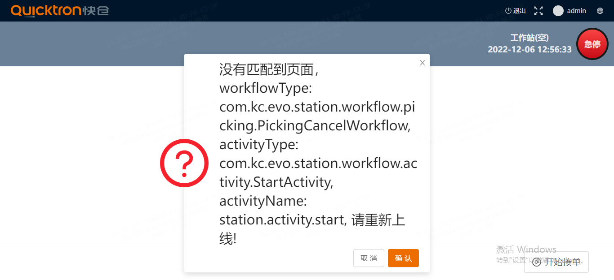

# QuickTron问题解决

### 1 小车在地图上打转：

- 可能是目标点和起点一样的原因
- 可能是目标点位有问题，影响了使用，可以将任务停掉然后将货架换一个位置，再下单试试：停任务需要
  - 关闭上层任务如上架调度
  - 将bucket_move_job的状态CANCEL掉
  - 删除agv_job里相关任务

### 2 如果下发出库单的时候 evo-wcs-engine 宕了

出现上面的情况任务下发wcs会失败，出库单和集合单处于 PREPARE_DISPATCH 状态，这个时候可以：

- 到 evo_wes_picking.picking_work表里将涉及到的pickingWork状态改为CANCEL；
- 然后将evo_wes_picking.picking_order 的状态改为 WAITING_SUBMIT；
- 再将evo_wes_picking.picking_order_group的状态改为WAITING_SUBMIT；
- 最后到web界面的集合单管理处，将该集合单重新提交。

于是单子则会重新下发，正常操作。

## 3. radial 料箱 空料箱上架小车到站后报错问题

工作站下线，清楚下redis缓存，再上线后既可以使用了，愿意不明。但只有一个等待点能用，另一个依然不可以用。

## 4. 工作站报如下图错误

可以到后门看看当前未完结的任务，把他DONE掉，然后再刷新下

## 5. flyway报错

可以看看 evo_wes_basic.flyway_schema_history搜报错版本，然后将其后面的success临时改为1

## 6. 如果新部署的环境，明明新导入了sql文件结果还是不对

有可能是因为ipaddr.sh文件不对，加载成了其他的服务器的sql