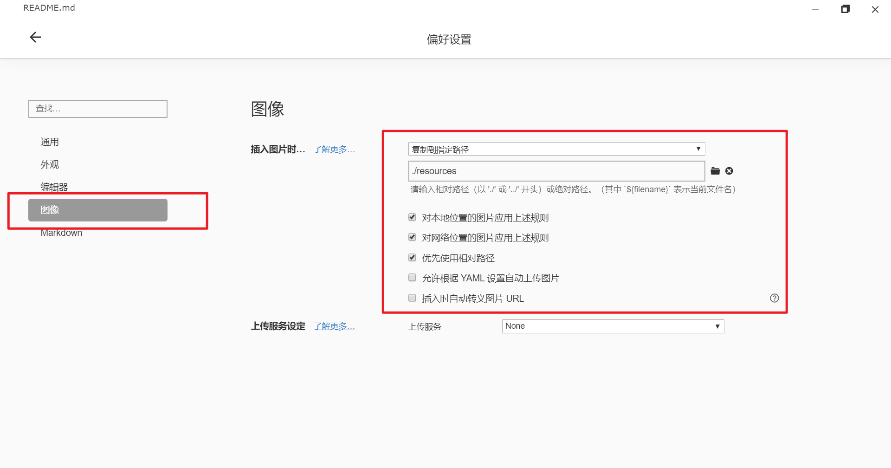

# README

记录工作学习中遇到的博客

## 1 Setting:

### 1.1 图片保存方式设置

## commit log

- first commit home -20210822
- commit home -20210822 deploy self blog successfully, the link of blog [ppdream](www.ppdream.xyz)

### 测试内容

### 测试 vscode + git的组合

### 测试使用所见即所得的类typora markdown插件，目前使用

### 测试所谓即使渲染
## 测试obsidian

add .gitignore and remove .obsidian

### 测试utools的插件：图床

白那些奥利加速度卡里克打开拉萨三大石窟

斯科拉觉得

## first commit from mac14