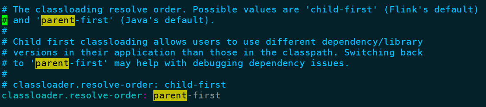

# BUG list

### 1.查询、插入等操作报错

> 初次搭建的flink，未作其他配置，flink sql-client中创建了一个Kafka连接的表，对该表查询、插入操作，报错如下：

```sql
Flink SQL> select * from CustomerStatusChangedEvent;
[ERROR] Could not execute SQL statement. Reason:
java.lang.ClassCastException: org.codehaus.janino.CompilerFactory cannot be cast to org.codehaus.commons.compiler.ICompilerFactory
```

#### 解决办法：

在`$FLINK_HOME/conf/flink_conf`中添加一行：（原先是child-first）

```sh
classloader.resolve-order: parent-first
```




### 2.使用自定义的yaml文件启动flink sql-client

> 使用自定义的yaml文件启动flink sql-client后，表正确创建，无法查询，报错如下


#### 解决办法：

需在启动sql client的命令后加上默认的sql-client配置文件

```sh
./bin/sql-client.sh embedded -d conf/sql-client-defaults.yaml -e conf/sql-test.yaml
```

### 3.查询数据时报错

> 查询报错


#### 解决办法：

需在启动sql client的命令后加上lib依赖库

```sh
./bin/sql-client.sh embedded -d conf/sql-client-defaults.yaml -e conf/sql-test.yaml -l lib
```

这样才能读取到

### 4.读取数据时报错

> 无法解析时间格式


#### 解决办法：

https://blog.csdn.net/appleyuchi/article/details/111291084

据博客介绍：可能原因是版本不兼容，官网使用的示例是flink1.11的版本，而我的是1.12，.yaml方式较老，新的不适用了