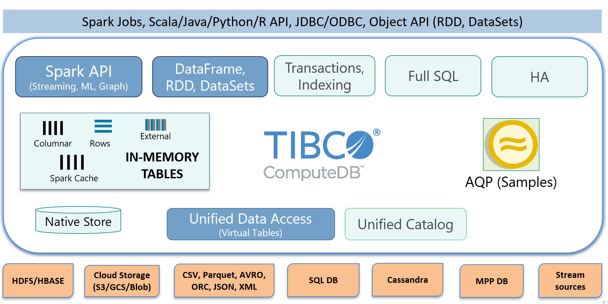

# overview

### snappydata 与spark的区别：

Apache Spark是用于大规模分析的通用并行计算引擎。 它的核心是一个批处理设计中心，并且能够处理不同的数据源。 尽管这提供了对数据的丰富统一访问，但是这也可能非常低效且昂贵。 

分析处理需要重复复制大量数据集，并重新格式化数据以适合Apache Spark。 在许多情况下，它最终无法实现交互式分析性能的承诺。 例如，每次在大型Cassandra表上运行聚合时，都需要将整个表流式传输到Apache Spark中进行聚合。 Apache Spark中的缓存是一成不变的，会导致过时的洞察力。

### snappydata 架构




### quickstart

#### quickstart01

```sh
$ cd $SNAPPY_HOME
$ ./bin/snappy-job.sh submit \
   --app-name CreatePartitionedRowTable \
   --class org.apache.spark.examples.snappydata.CreatePartitionedRowTable \
   --app-jar examples/jars/quickstart.jar \
   --lead localhost:8090
```

```json
{
  "status": "STARTED",
  "result": {
    "jobId": "321e5136-4a18-4c4f-b8ab-f3c8f04f0b48",
    "context": "snappyContext1452598154529305363"
  }
}
```

```sh
$ ./bin/snappy-job.sh status --lead localhost:8090 --job-id 321e5136-4a18-4c4f-b8ab-f3c8f04f0b48
```

#### quitckstart02

##### Snappy Session Usage

###### Create Columnar Tables using API

使用spark-shell完成以下，操作，但在snappy-sql中无法观察到该表，故该表不是内存表，是流表

```scala
import org.apache.spark.sql.SnappySession
val snappy = new SnappySession(sc)

val props = Map("BUCKETS" -> "8")// Number of partitions to use in the Snappy Store
case class Data(COL1: Int, COL2: Int, COL3: Int)
val data = Seq(Seq(1, 2, 3), Seq(7, 8, 9), Seq(9, 2, 3), Seq(4, 2, 3), Seq(5, 6, 7))
val rdd = spark.sparkContext.parallelize(data, data.length).map(s => new Data(s(0), s(1), s(2)))
val snappy = new SnappySession(sc)
val df = snappy.createDataFrame(rdd)
// create a column table
snappy.dropTable("COLUMN_TABLE", ifExists = true)
// "column" is the table format (that is row or column)
// dataDF.schema provides the schema for table
snappy.createTable("COLUMN_TABLE", "column", df.schema, props)
// append dataDF into the table
df.write.insertInto("COLUMN_TABLE")
val results = snappy.sql("SELECT * FROM COLUMN_TABLE")
println("contents of column table are:")
results.foreach(r => println(r))

```

#### quickstart03

```sh
./bin/snappy-job.sh submit     \
--app-name CreatePartitionedRowTable     \
--class org.apache.spark.examples.snappydata.CreatePartitionedRowTable     \
--app-jar examples/jars/quickstart.jar     \
--lead localhost:8090
```

```scala
import org.apache.spark.sql.SnappySession
val snappy = new SnappySession(sc)

// create a row format table called ROW_TABLE
snappy.dropTable("ROW_TABLE", ifExists = true)
// "row" is the table format
// dataDF.schema provides the schema for table
val props2 = Map.empty[String, String]
snappy.createTable("ROW_TABLE", "row", dataDF.schema, props2)
// append dataDF into the data
dataDF.write.insertInto("ROW_TABLE")
val results2 = snappy.sql("select * from ROW_TABLE")
println("contents of row table are:")
results2.foreach(println)
// row tables can be mutated
// for example update "ROW_TABLE" and set col3 to 99 where
// criteria "col3 = 3" is true using update API
snappy.update("ROW_TABLE", "COL3 = 3", org.apache.spark.sql.Row(99), "COL3" )
val results3 = snappy.sql("SELECT * FROM ROW_TABLE")
println("contents of row table are after setting col3 = 99 are:")
results3.foreach(println)
// update rows using sql update statement
snappy.sql("UPDATE ROW_TABLE SET COL1 = 100 WHERE COL3 = 99")
val results4 = snappy.sql("SELECT * FROM ROW_TABLE")
println("contents of row table are after setting col1 = 100 are:")
results4.foreach(println)

```


```sh
./bin/snappy-job.sh submit \
--lead localhost:8090 \
--app-name kafka2snappy \
--class snappy.SnappyApiTest \
--app-jar /opt/code/self-snappydata/kafka2snappy-wx-1.0.jar
```

