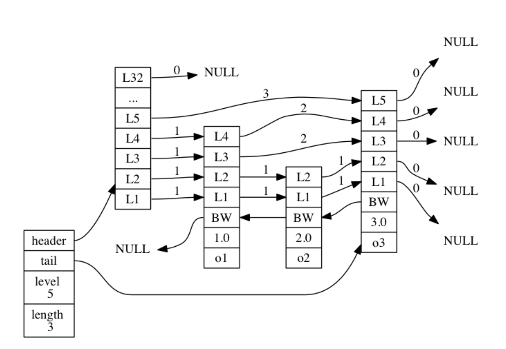

# Redis 阅读笔记

> 目的是速记，不要拘谨

## Redis总览

- Redis命令很多，但有互通性，不可死记硬背
- Redis和其数据结构不是万金油，不可胡乱使用
- 通用命令：keys, dbsize, exists, del, expire, ttl, type
- Redis对外数据结构：string, list, hash, set, zset，每个类型都有内部的编码格式，并且不止一个，可以使用 `object encoding` 来查看键的内部编码

- 内部编码的好处：抽象内聚，更换底层编码时不会影响外部使用；适用多种情景，选择最合适的内存时间搭配

- Redis使用了单线程架构和I/O多路复用技术来实现高性能

  - 单线程还能如此之快的原因：
    - 纯内存访问：主要原因
    - 非阻塞I/O （IO多路复用）：epoll
    - 单线程避免了线程切换和竞态损耗
      - 编码，结构简单
      - 避免线程切换和竞态损耗
  - 单线程存在的问题：
    - 因为是单线程的所以多条命令需要排队，因此每条命令的执行时间不可过长 （redis使用规范，redis优化）

- 字符串：string

  > 字符串是最基础的数据结构，所有的键都是字符串，其他数据结构也是以字符串为基础

  - 字符串、数字、二进制，不可超过512MB

  - 命令：

    - set, set ex, set px, set nx, set xx, setnx, setex

    - get, mset, mget, incr, decr

      > mset, mget可以减少n-1次网络io时间，redis的效率很高，很多时候瓶颈在网络等其他io耗时
      >
      > 批量操作会减少网络io消耗，但要注释数量，否则可能造成redis或网络阻塞

    - append, strlen, getset, setrange, getrange, 

  > 以上操作除了m批量操作外，时间复杂度都是O(1)，这是因为redis使用了自己的字符串结构，优化了各种查询等操作，而非c语言本身的结构

  - 内部编码
    - int：8字节长整型
    - embstr：<=39字节的字符串
    - raw：>39字节

- redis典型使用场景：缓存，计数，共享session，限速

- 字典：hash

  > 键值对：key:filed:value

- - 命令
  - hset, hget, hdel, hlen, hmget, hmset, hexists, hkeys, hvals, hgetall, hscan
    
    -  hincrby, hincrbyfloat, hstrlen, 
    
  - 内部编码
    - ziplist：当元素个数<hash-max-ziplist-entries 且 所有值都<hash-max-ziplist-value值时，更加节省内存
    - hashtable：其他情况。读写速度较快
    
  - hash类型和关系型数据库的不同：
  
    - hash是稀疏的，关系型数据库是完全结构化的
    - 关系数据库可以做复杂的关联查询
  
  - 三种cache实现方式：
  
    - 字符串直接实现：user1:tom:name tom; user1:tom:birth 1998; user1:tom:sex 1
    - 序列化实现：user1:tom serialize(tom)
    - hash：user1:tom name tom birth 1998 sex 1
  
    > 各有优缺点，自行判断
  
- 列表：list

  > 存储多个有序字符串

  - 一个列表最多可存储2^32 -1个元素
  - 特点
    - 元素有序
    - 元素可重复
  - 命令：lpush, rpush, lrange, linsert, lindex, llen, lpop, rpop, lrem, ltrim, lset
  - blpop, brpop (可以做消息队列)
  - 内部编码
    - ziplist：当元素个数小于 `list-max-ziplist-entries`，且每个元素小于 `list-max-ziplist-value`时是ziplist；节约内存
    - linkedlist：否则是linkedlist；节约时间
    - quicklist：新加类型，结合了ziplist和linkedlist
  - 使用场景
    - 消息队列
    - 文章列表
  - 口诀：
    - lpush + lpop = Stack
    - lpush + rpop = Queue
    - lpush + ltrim = Capped Collection (有限集合)
    - lpush + brpop = Message Queue (消息队列)
  
- 集合：set

  > 无序，无重复

  - 一个集合最多可存储2^32 -1个元素
  - Redis支持集合内**增删改查**，还支持集合间取**交，并，差集**
  - 命令：
    - sadd, srem, scard, sismember, srandmember, spop, smembers, sscan
    - sinter, sunion, sdiff; sinterstore, sunionstore, sdiffstore
  - 内部编码
    -  intset：当元素都是整数 且 元素个数小于 `set-max-intset-entries` (默认512个)
    - hashtable：其他情况为此编码，速度快
  - 使用场景
    - 标签 （用户和标签的关系维护应该在一个事务里进行）
  - 主要场景
    - sadd = 标签
    - spop / srandmember = Random item (随机数，抽奖)
    - sadd + sinter = Social Graph (社交)

- 有序集合：zset

  > 每一个元素都有一个分数属性作为排序依据，元素不可重复，但分数可以重复

  - 命令：zadd, zadd nx, zadd xx, zadd ch, zadd incr
    - zcard, zscore, zrank, zrevrank, zrem, zincrby, zrange, zrevrange
    - zrangebyscore, zrevrangebyscore, zcount, zremrangebyrank, zremrangebyscore
    - zinter, zunion, zinterstore, zunionstore
  - 内部编码
    - ziplist：当元素个数小于`zset-max-ziplist-entries` (默认是128个)，且每个元素的值小于 `zset-max-ziplist-value` （默认是64字节）
    - skiplist：其他情况；读写速度快，占用内存大
  - 使用场景
    - 排行榜
  
- 建管理

  - rename, renamenx, randomkey
  - expire, expireat, pexpire, pexpireat, pttl, persist

- 迁移键

  - move：redis内部数据库间移动
  - dump + restore：从源向目的数据库实例移动
  - migrate：原子执行；将 dump, restore, del 三个操作组合使用；支持迁移多个键；只需要在源redis上执行即可

- 遍历键

  - keys: `glob`风格的匹配

    - keys *
    - keys hel*
    - keys ?ello
    - keys [jr]edis
    - keys \[^j]edis
    - keys [a-z]edis
    - 大量键情况下有可能阻塞

  - scan：渐进式遍历

    > 使用hashtable数据结构

    - scan cursor match type
  
- dbsize, select, flushdb/flushall

## Redis数据结构

- hash
    - 入键过程
        - 计算键的hash值：MurmurHash3
        - 散列：
        - rehash：链表法（头插法）
        - 渐进式rehash：为防止表中数量过多，直接从tb0复制到tb1导致阻塞，采用渐进式rehash方式；旧表只减不增

- skiplist：跳表

    > 跳表：平均：O(logN)；最坏：O(N)
    >
    > 大部分情况下，效率媲美平衡树；实现比平衡树简单
    >
    > 有序集合的所有元素都存在一个跳表中
    >
    > 用处：有序集合键；集群节点中用作内部数据结构

    - zskiplist

    ```c
    typedef struct zskiplist {
        // header 跳表头节点
        // tail 跳表尾节点
        struct zskiplistNode *header, *tail;
        // 跳表长度（表头结点的层数不算在内）
        unsigned long length;
        // 跳表层数最大的那层的层数（表头结点不算在内）
        int level;
    } zskiplist;
    ```

    - zskiplistNode

    ```c
    /* ZSETs use a specialized version of Skiplists */
    typedef struct zskiplistNode {
        // 键
        sds ele;
        // 分数
        double score;
        // 后退指针
        struct zskiplistNode *backward;
        struct zskiplistLevel {
            // 前进指针
            struct zskiplistNode *forward;
            // 前进跨度
            unsigned long span;
        } level[];
    } zskiplistNode;
    ```

    

    - 层
        - level数组包含多个元素，每个元素都包含一个指向其他节点的指针
        - 幂次定律：越大的数出现的概率越小；使用幂次定律在创建新层的时候随即指定一个层的高度
        
    - 实现：[SkipList.md](./sourcecode/SkipList.md)
    
        > 如果要放到网上需要将此处更新为超链接
    
- IO多路复用技术

    > 常用的IO模型有四种：同步阻塞IO；同步非阻塞IO；IO多路复用；异步IO

    // todo

- intset 整数集合

    > 提供集合升级功能以支持各种长度的数据
    >
    > 一旦升级不支持降级

- ziplist 压缩集合

- quicklist 快速表

    > quicklist是一个双向链表，并且是一个ziplist的双向链表

- 浮点型是当作字符串来存储的


## 总结

- 主要数据结构：字符串（SDS），双端链表，字典，压缩列表，整数集合，快速表，跳表

    > Redis没有直接使用这些数据结构，而是基于这些数据结构构建了一个对象系统

- 对象系统：字符串对象，列表对象，哈希对象，集合对象，有序集合对象

    > 每种对象都用到了一种或多种数据结构

- 好处：

    - 针对不同的使用场景，更换底层实现，平衡内存和速度；
    - Redis还实现了基于引用计数的内存回收，让内存使用更安全
    - Redis对象带有访问时间记录信息，优先删除空转时间较长的键

- 对象

    - 每当我们向库中添加一对键值对时，实际会创建两个对象，一个键对象，一个值对象

    - 对象实现：(redis 6.2.6)

        ```c
        typedef struct redisObject {
            unsigned type:4;
            unsigned encoding:4;
            unsigned lru:LRU_BITS; /* LRU time (relative to global lru_clock) or
                                    * LFU data (least significant 8 bits frequency
                                    * and most significant 16 bits access time). */
            int refcount;
            void *ptr;
        } robj;
        ```

    - 类型(type)

        - REDIS_STRING

        - REDIS_LIST

        - REDIS_HASH

        - REDIS_SET

        - REDIS_ZSET

            > 之后的版本中还有新加的高级结构：**HyperLogLog、Geo、BloomFilter**

    - 编码（encoding,）

        - encoding属性记录对象使用的编码
        - REDIS_ENCODING_INT
        - REDIS_ENCODING_EMBSTR
        - REDIS_ENCODING_RAW
        - REDIS_ENCODING_HT
        - REDIS_ENCODING_LINKEDLIST
        - REDIS_ENCODING_ZIPLIST
        - REDIS_ENCODING_INTSET
        - REDIS_ENCODING_SKIPLIST
        - REDIS_ENCODING_QUICKLIST

    - 底层实现（*ptr）

        - *ptr 指向底层实现的数据结构

    - 每种类型对应的编码：

| 类型 type    | 编码 encoding            |
| ------------ | ------------------------ |
| REDIS_STRING | REDIS_ENCODING_INT       |
| REDIS_STRING | REDIS_ENCODING_EMBSTR    |
| REDIS_STRING | REDIS_ENCODING_RAW       |
| REDIS_LIST   | REDIS_ENCODING_ZIPLIST   |
| REDIS_LIST   | REDIS_ENCODING_QUICKLIST |
| REDIS_HASH   | REDIS_ENCODING_ZIPLIST   |
| REDIS_HASH   | REDIS_ENCODING_HT        |
| REDIS_SET    | REDIS_ENCODING_INTSET    |
| REDIS_SET    | REDIS_ENCODING_HT        |
| REDIS_ZSET   | REDIS_ENCODING_ZIPLIST   |
| REDIS_ZSET   | REDIS_ENCODING_SKIPLIST  |


## Redis 操作底层

> v2.8

redis.h/redisServer

- redisServer中有一个 redisDb的数组，存储所有数据库
- 每个redisDb结构代表一个数据库
- redisClient 客户端结构: redisDb *db 记录当前客户端正在使用的数据库
- redisDb 结构表示一个数据库：
    - dict *dict 保存了数据库中的所有键值对 (key space):
        - dictht ht[2]
            - dictEntry **table
                - void *key 
                - union {void *val; uint64_t u64; int64_t s64;} v;
- expire; pexpire; expireat; pexpireat.最终都会转换成 pexpireat命令来实现 
    - dict *expire 保存了键的过期时间 
        - dictht ht[2]
            - dictEntry **table
                - void *key: 指向键空间中的对应对象
                - union ... v 指向一个long long类型的整数：保存以哦个毫秒精度的UNIX时间戳
    - 步骤：
        - 对一个键设置过期时间
            - expireat pexpireat时 basetime=0
            - expire expireat时 s -> ms
            - 未取到key时返回0
            - 如果已过期 且 服务器是主节点 且 没有在载入数据 时 不直接删除过期的键而是等待显示执行del
            - 此外：设置键过期时间；发送键空间改变信号；提醒键空间 发生了expire事件； 数据库被修改次数++； 返回
- 过期键删除策略：
    - 定时删除：键过期时间到的时候同步删除；省内存；占cpu；如果遇到大批量一次性删除时会占用cpu
    - 惰性删除：过期后先不删除，等待再次获取该键的时候再删除；占内存；省cpu；如日志等不适合
    - 定期删除：每隔一段时间检查一次，将过期键删除；需要平衡间隔时间和删除时常；否则会退化成定时或惰性删除。

- 惰性删除实现：
    - expireIfNeeded: 所有读写数据库的Redis命令再执行之前都会调用 expireIfNeeded 函数检查输入键
        - 如果已过期则删除
        - 否则不做动作
        - 像一个过滤器
        - 每个命令的实现函数都必须能同时处理键存在和键不存在两种情况

- 定期删除实现：
    - activeExpireCycle：规定时间内，分多次遍历服务器中各个数据库，从数据库的expires字典中随机检查一部分键的过期时间，并删除其中过期键
        - 函数每次运行时，从一定数量的数据库中随机取出一定数量的键进行检查，删除其中过期的
        - `current_db`会记录当前函数检查进度，等待下次时接着进行
        - 当所有数据库都被检查一遍后，`current_db`变量会重置为0，开始新一轮

- 已过期的键不会被保存到RDB文件中

## 持久化

> AOF、RDB和复制功能对过期键的处理

### RDB
- dirty: dirty计数器记录上一次成功执行`SAVE`或者`BGSAVE`后服务器（所有数据库）又进行了多少次修改。
- lastsave: 记录上一次执行保存的时间

### AOF

- 命令追加：在执行一个写命令之后会以协议格式将执行的写命令追加到服务器状态的aof_buf缓冲区末尾
- 文件写入，文件同步：appendfsync选项的值决定
    - alaways：将aof_buf缓冲区的所有内容写入并同步到AOF文件
    - everysec：将aof_buf缓冲区的所有内容写入到AOF文件，如果上次同步AOF文件时间过去了一秒钟，那么再次同步AOF文件（由一个线程专门负责执行）
    - no：将aof_buf缓冲区所有内容写入到AOF文件，不同步，何时同步由操作系统来决定

效率与安全性：

| appendfsync选项 | 效率   | 安全性 | 说明                                                         |
| --------------- | ------ | ------ | ------------------------------------------------------------ |
| always          | 最低   | 高     | 每个事件循环都要讲缓冲区所有内容写入到AOF文件并且同步        |
| everysec        | 不错   | 不错   | 每个事件都将缓冲区内容写入到AOF文件，并且每隔一秒同步        |
| no              | 也不错 | 低     | 每个事件都将缓冲区内容写入到AOF文件，何时同步AOF文件由操作系统控制 |

- 读取AOF文件与数据还原：
    - 创建一个不带网络连接的伪客户端：Redis命令只能在客户端上下文执行
    - 从AOF文件中分析并读取出一条命令
    - 使用伪客户端执行被读出的写命令
    - 一直执行2、3两步直到AOF文件读取和处理完毕

### AOF重写

为了防止AOF文件过大的问题，Redis会创建一个新的AOF文件提到旧的，新的AOF文件**不会存在冗余命令**体积小很多。

**AOF重写：**虽然叫AOF重写但其实并不会读取现有的AOF文件，而是通过服务器状态来实现的。

`BGREWRITEAOF`：主进程执行写命令，创建子进程执行AOF重写，主进程继续写命令，子进程重写好后向父进程发送信号，父进程将子进程在重写阶段产生的新写命令从缓冲区取出追加到新AOF文件尾。用新AOF文件覆盖旧的。

## 事件

- 文件事件：基于Reactor模式：文件事件处理器(file event handler)

    - I/O多路复用：同时监听多个socket，并根据socket目前执行的任务来为socket关联不同的事件处理器

    - 当被监听的socket准备好执行连接accept、read、write、close等操作时，与操作对应的文件事件就会产生，这时文件事件处理器就会调用socket事先关联好的事件处理器来处理这些事件

    - 文件事件处理器的构成：

        > 文件事件是对socket的抽象，I/O多路复用监听多个socket并向dispatcher发送那些产生了事件的socket。socket可能并发的来，但都会被I/O多路复用程序放到一个队列中，通过这个队列有序、同步、每次一个的方式向dispatcher传送socket。上一个事件处理完，才会发送下一个socket到dispatcher‘

        - socket
        - I/O多路复用程序
            - 实现：对常见I/O多路复用函数库进行包装；单独成文件：ae_select.c, ae_epool.c, ae_kqueue.c...；API相同，故底层实现可互换
        - 文件事件分派器(dispatcher)
        - 事件处理器：一个个函数，定义了某个事件发生时服务器应该执行的操作

    - 事件类型：I/O多路复用程序可以监听 AE_READABLE\AE_WRITABLE事件对应如下：

        - 当socket变得可读时：客户端对socket执行write操作，或者执行close操作；或者有新的可应答（accepted）socket出现时（客户端对服务器的监听socket执行connect操作），socket产生AE_READABLE事件
        - 当socket变得可写时：客户端对socket执行read操作，socket产生AE_WRITABLE事件
        - 如果一个socket即可读又可写时：先读再写

- 时间事件


