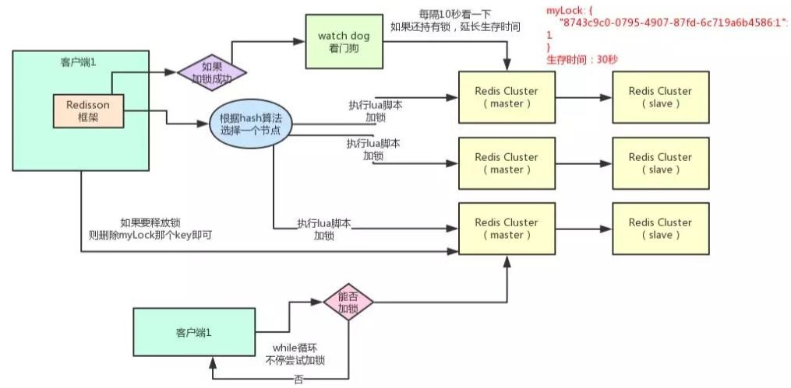

# Overview

> Redisson

Redisson是使用Java编写的一套Redis客户端；他方便的支持了诸多如分布式锁的操作。

## 一、底层原理图



​																							**Redisson底层架构图**

## 二、Redisson实现分布式锁核心代码

### 2.1 业务代码：

```java
private String doLock() {
    String lockKey = "myLock";  // 锁名称
    // 生成锁（即向redis中插入一个以 "myLock"作为key的键值对，具体的逻辑可见下文）
    RLock lock = redisson.getLock(lockKey);  

    try {
        lock.lock(); // 加锁
        doWork(); // 核心业务
    } finally {
        lock.unlock(); // 释放锁
    }
    return "end";
}
```

### 2.2 核心逻辑（lua）

#### 2.2.1 加锁

Redisson加锁的核心操作是使用lua脚本编写的，lua脚本在redis中是原子执行的

全限定名：`org.redisson.RedissonLock.tryLockInnerAsync`

```lua
-- 判断要加的那个锁是否存在（即redis中是否已经存在 "myLock"这个字段）
-- KEYS[1]: 业务代码传过来的锁名称："myLock";
if (redis.call('exists', KEYS[1]) == 0) then 
    -- ARGV[2]: 加锁的客户端的id（唯一标识）
    redis.call('hincrby', KEYS[1], ARGV[2], 1);   
	-- ARGV[1]: 代表默认的加锁时间：30s；
    redis.call('pexpire', KEYS[1], ARGV[1]);   
    return nil; 
end; 

-- 判断当前客户端是不是加锁的客户端
if (redis.call('hexists', KEYS[1], ARGV[2]) == 1) then 
	-- 如果是则将其值加1
    redis.call('hincrby', KEYS[1], ARGV[2], 1); 
	-- 刷新过期时间
    redis.call('pexpire', KEYS[1], ARGV[1]); 
    return nil; 
end; 

-- 返回当前锁的过期时间
return redis.call('pttl', KEYS[1]);
```

#### 2.2.2 释放锁

释放锁的主要操作是用lua脚本编写的

全限定名：`org.redisson.RedissonLock.unlockInnerAsync`

```lua
-- 判断 "myLock.id" 键是否存在，不存在则返回
if (redis.call('hexists', KEYS[1], ARGV[3]) == 0) then
    return nil;
end;
-- 存在则将该键对应的值减1并返回减1后的值
local counter = redis.call('hincrby', KEYS[1], ARGV[3], -1);
if (counter > 0) then
    -- 如果返回结果>0则刷新过期时间后返回
    redis.call('pexpire', KEYS[1], ARGV[2]);
    return 0;
else
    -- 否则，删除清除该锁即删除掉 myLock
    redis.call('del', KEYS[1]);
    -- 
    redis.call('publish', KEYS[2], ARGV[1]);
    return 1;
end;
return nil;
```

### 2.3 场景分析

#### 2.3.1 加锁

如果是**第一个**线程**第一次**过来将进入第一个`if`判断，并执行**加锁**、**设置锁过期时间**、返回 （加锁；过期时间：防止服务宕掉；id：防止其他线程释放我加的锁）

如果是**第一个**不是第一次过来，则进入第二个`if`判断，并执行 **锁的值加1**、**刷新过期时间**、返回 （即可重入锁的实现）

如果不是**第一个**线程过来，将会跳过两个if，直接返回当前锁的剩余时间 （互斥）

#### 2.3.2 释放锁

如果是当前线程进行释放锁，将锁的值减1并刷新锁过期时间；根据返回结果判断如果为0则删除该锁并返回

如果是其他线程来释放锁，会发现在redis中的“myLock” 锁下并不存在当前线程的id，即并非当前线程加的锁，不允许释放，返回

### 2.4 Watch Dog

看门狗的核心逻辑是用Java编写的，核心处理操作依然是用lua实现的

```Java

private void renewExpiration() {
    // 判断需要刷新的锁的封装对象是否存在
    ExpirationEntry ee = EXPIRATION_RENEWAL_MAP.get(getEntryName());
    if (ee == null) {
        return;
    }
    
    // 起一个延时执行的任务来做刷新锁过期时间的操作
    Timeout task = commandExecutor.getConnectionManager().newTimeout(new TimerTask() {
        @Override
        public void run(Timeout timeout) throws Exception {
            ExpirationEntry ent = EXPIRATION_RENEWAL_MAP.get(getEntryName());
            if (ent == null) {
                return;
            }
            Long threadId = ent.getFirstThreadId();
            if (threadId == null) {
                return;
            }
            // 刷新过期时间的核心操作，在下侧的代码块有详细介绍
            RFuture<Boolean> future = renewExpirationAsync(threadId);
            future.whenComplete((res, e) -> {
                if (e != null) {
                    log.error("Can't update lock " + getRawName() + " expiration", e);
                    EXPIRATION_RENEWAL_MAP.remove(getEntryName());
                    return;
                }
                // 如果renewExpirationAsync的返回结果为真即线程仍持有锁并刷新成功，则将在延时（internalLockLeaseTime / 3）后递归调用自身
                if (res) {
                    // reschedule itself
                    renewExpiration();
                } else {
                    // 否则即锁已经被释放了，取消掉该锁的定时任务
                    cancelExpirationRenewal(null);
                }
            });
        }
    }, internalLockLeaseTime / 3, TimeUnit.MILLISECONDS);
    
    ee.setTimeout(task);
}
```

全限定名：`Rorg.redisson.RedissonBaseLock.renewExpirationAsync`

```lua
-- 如果 redis中 "myLock"下有当前线程id，则说明仍是当前线程持有锁
if (redis.call('hexists', KEYS[1], ARGV[2]) == 1) then 
    -- 则将该锁刷新过期时间
    redis.call('pexpire', KEYS[1], ARGV[1]); 
    return 1; 
end; 
-- 否则返回0；到外部逻辑中移除该定时任务
return 0;
```

为防止当前线程运行时间长于锁的过期时间，即还未运行完锁就自动释放了的情况发生，在第一次加锁的时候就同时新启一个线程（WatchDog: 看门狗）去每隔三分之一 锁过期时间去判断锁是否还被当前线程持有，如果仍持有就刷新过期时间，否则退出

### 2.5 问题

这种加锁、释放锁的机制看似完美无缺，但仍有瑕疵。

redis集群间采用异步复制策略来同步数据。这样当线程1将锁加到了master服务器上，而master服务器宕机了，这时候slave服务器会提升为master服务器。但此时数据并未完全同步过来，即第一个线程加锁的那条数据未同步过来，此时另一个线程在新的master服务器上加了锁。

于是，线程1觉得自己加锁了，线程2也觉得自己加锁了，那么都会继续运行下去，则会发生脏数据问题。

### 2.6 解决

2.5 中提到的问题只会在一些极个别的情况下才会发生，所以如果对此不是很敏感的话完全可以忽略。

但如果必须完美的避免这个问题的话则可以尝试使用zookeeper来进行管理，zookeeper是数据强一致性的。zookeeper在新增了一条数据后会先内部同步到一半以上的服务器上去之后才对外表示自己已插数据，即会先将锁信息同步到多台从服务器上之后才返回已经加锁的信息，这样即使主服务器宕机了也可以保证新的master服务器上会有锁信息。


