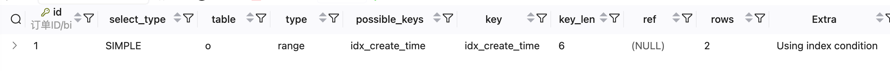

# EXPLAIN功能



> 执行 Explain 的时候，如果涉及到多表（join 或子查询）则会出现各查询的执行计划

## 字段

- id(执行顺序): 当有多个id时，如果id都相同则按顺序执行，如果id不同，则id大的先执行，如果id=null表示结果集合并如union

- select_type(查询类型)：

| 类型               | 含义                           |
| :----------------- | :----------------------------- |
| SIMPLE             | 简单查询，不包含子查询或 UNION |
| PRIMARY            | 最外层的查询                   |
| SUBQUERY           | 子查询（不在 FROM 子句中）     |
| DERIVED            | 衍生表（FROM 子句中的子查询）  |
| UNION              | UNION 中的第二个或后面的查询   |
| UNION RESULT       | UNION 的结果集                 |
| DEPENDENT SUBQUERY | 依赖外部结果的子查询           |

```sql
-- SIMPLE
EXPLAIN SELECT * FROM users WHERE age > 18;
-- PRIMARY + SUBQUERY
EXPLAIN SELECT * FROM users WHERE id IN (SELECT user_id FROM orders WHERE amount > 100);
-- PRIMARY + DERIVED
EXPLAIN SELECT * FROM (SELECT * FROM users WHERE age > 18) AS t;
```

- table: 表名或衍生表名

- type: （⭐ 重要）性能从好到差：system > const > eq_ref > ref > range > index > ALL

| 类型       | 说明                         | 示例                                |
| :--------- | :--------------------------- | :---------------------------------- |
| **system** | 系统表，只有一行数据         | 极少见                              |
| **const**  | 主键或唯一索引等值查询       | `WHERE id = 1`                      |
| **eq_ref** | 联表查询，使用主键或唯一索引 | JOIN 中使用主键关联                 |
| **ref**    | 使用非唯一索引等值查询       | `WHERE name = '张三'`（name有索引） |
| **range**  | 索引范围扫描                 | `WHERE id BETWEEN 1 AND 100`        |
| **index**  | 全索引扫描                   | 索引覆盖但需要扫描全部              |
| **ALL**    | 全表扫描（最差）             | 无索引条件                          |

```sql
-- const：主键等值查询
EXPLAIN SELECT * FROM users WHERE id = 100;
-- eq_ref：联表使用主键
EXPLAIN SELECT * FROM users u JOIN orders o ON u.id = o.user_id;
-- ref：普通索引等值
EXPLAIN SELECT * FROM users WHERE email = 'test@example.com';
-- range：范围查询
EXPLAIN SELECT * FROM users WHERE age BETWEEN 18 AND 30;
-- ALL：全表扫描（危险）
EXPLAIN SELECT * FROM users WHERE email = 'test@example.com';  -- email 无索引
```

- possible_keys: 可能用到的索引

- key: 实际用到的索引 NULL 表示未使用索引

- key_len: 使用的索引的字节数可以判断使用了联合索引的哪部分

- ref: 

- rows: 优化器预计需要扫描的行数，越小越好，与实际可能有差异
- filtered: 表示存储引擎返回的数据在 Server 层过滤后的剩余百分比,100% 表示全部符合条件,值越低说明需要更多过滤操作

- Extra: （⭐ 重要）额外信息

| 值                        | 含义                 | 优化建议                              |
| :------------------------ | :------------------- | :------------------------------------ |
| **Using index**           | 覆盖索引，不需要回表 | ✅ 理想状态                            |
| **Using where**           | 使用 WHERE 过滤      | 正常                                  |
| **Using index condition** | 索引下推（ICP）      | ✅ MySQL 5.6+ 优化                     |
| **Using temporary**       | 使用临时表           | ⚠️ 需要优化，常见于 GROUP BY、DISTINCT |
| **Using filesort**        | 文件排序             | ⚠️ 需要优化，索引可避免                |
| **Using join buffer**     | 使用连接缓冲区       | 考虑添加索引                          |
| **Impossible WHERE**      | WHERE 条件永远为假   | 检查业务逻辑                          |
| **No tables used**        | 没有使用表           | 如 `SELECT 1`                         |

## 优化建议

| 问题特征        | 优化方法                          |
| :-------------- | :-------------------------------- |
| type = ALL      | 添加合适的索引                    |
| type = index    | 缩小查询范围或覆盖索引            |
| Using filesort  | 对排序字段加索引                  |
| Using temporary | 优化 GROUP BY、DISTINCT，添加索引 |
| key = NULL      | 检查 WHERE 条件是否能用到索引     |
| rows 很大       | 优化条件，缩小扫描范围            |
| filtered 很小   | 考虑复合索引                      |

