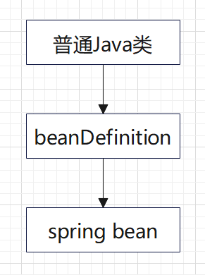
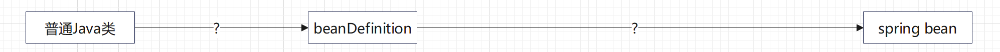

# spring bean lifecycle

## 一、overview

## 1/1 Spring Bean生成的底层逻辑

所以重点是这两个过程中都干了些什么

下面我们先来介绍下beanDefinition是个什么东西

## 1.2 beanDefinition

beanDefinition即普通Java类的一个包装类，包含了这个类的各种信息如**是否单例**，**是否懒加载**等

beanDefinition类全限定名：`org.springframework.beans.factory.config.BeanDefinition`

