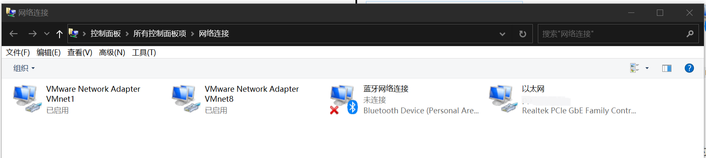
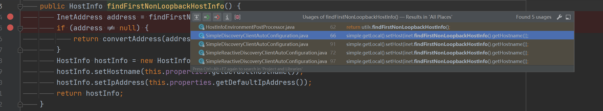
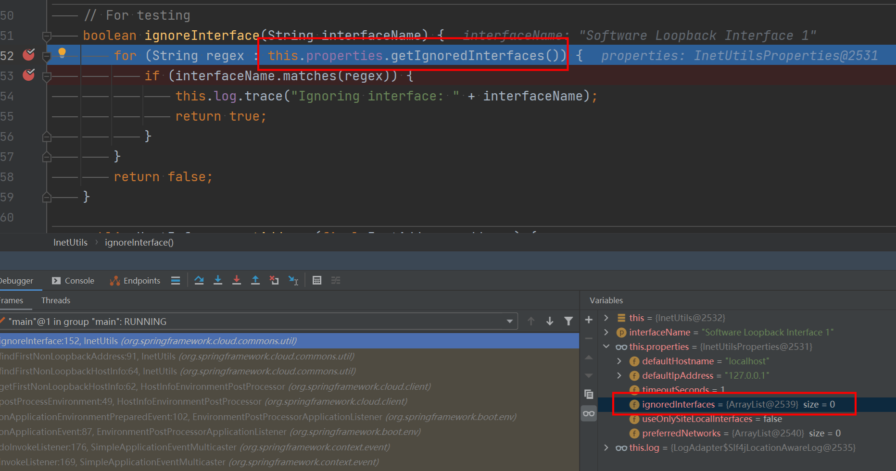

# Eureka多网卡选择问题
## 一. 总览
Eureka是spring cloud中的用于微服务注册的注册中心，提供给各微服务查看调用，也给用户（开发者）提供一个统一查看各微服务状态的地方。

## 二. 多网卡选择问题

### 2.1 背景

笔者部署spring cloud 服务的机器上有三个网卡，一个实际网卡（以太网），两个虚拟网卡（VMware Network Adapter VMnet1，VMware Network Adapter VMnet8）



在启动项目后发现注册到eureka上的服务绑定的都是 `VMware Network Adapter VMnet8`的虚拟IP，而并非本机实际对外的IP。而我想要将服务绑定的IP都固定到对外开放的这个IP。

在查阅了多个博客及官方文档后发现可以通过设置如下几个参数来指定想要绑定的IP或是排除不想绑定的IP

```yaml
spring:
  cloud:
    inetutils:
      # 排除不像绑定的IP，数组形式，支持正则表达式
      ignored-interfaces:
        - docker0
        - veth.*
      # 指定想要绑定的IP，数组形式，可以是网段
      preferredNetworks:
        - 192.168
        - 10.0
```

但在设置了该部分配置后，重新运行项目发现并未有所改变，于是只好使用debug大法。

首先通过查询资料得知spring cloud 没有自己实现获取网卡的操作，而是使用的 `org.springframework.cloud.commons.util.InetUtils`的`findFirstNonLoopbackHostInfo()`方法来获取的。从图中可以看到他有如下几个调用，分别打了断点后开始debug。



发现首先调用的是`HostInfoEnvironmenPostProcessor.getFirstNonLoopbackHostInfo()`方法，这个类正是用来获取本机的网络信息的。

我们向后继续一步步的debug，来到获取网卡的方法主体代码中(重新排版过)：

```java
public InetAddress findFirstNonLoopbackAddress() {
   InetAddress result = null;
   try {
      int lowest = Integer.MAX_VALUE;
      for (Enumeration<NetworkInterface> nics = NetworkInterface.getNetworkInterfaces(); nics.hasMoreElements();) {
         NetworkInterface ifc = nics.nextElement();
         if (ifc.isUp()) {
            this.log.trace("Testing interface: " + ifc.getDisplayName());
            if (ifc.getIndex() < lowest || result == null) {
               lowest = ifc.getIndex();
            } else if (result != null) {
               continue;
            }
             
            // @formatter:off
            if (!ignoreInterface(ifc.getDisplayName())) {
               for (Enumeration<InetAddress> addrs = ifc.getInetAddresses(); addrs.hasMoreElements();) {
                  InetAddress address = addrs.nextElement();
                  if (address instanceof Inet4Address && !address.isLoopbackAddress() && isPreferredAddress(address)) {
                     this.log.trace("Found non-loopback interface: " + ifc.getDisplayName());
                     result = address;
                  }
               }
            }
            // @formatter:on
         }
      }
   } catch (IOException ex) {
      this.log.error("Cannot get first non-loopback address", ex);
   }

   if (result != null) {
      return result;
   }

   try {
      return InetAddress.getLocalHost();
   } catch (UnknownHostException e) {
      this.log.warn("Unable to retrieve localhost");
   }

   return null;
}
```

代码主要分为四个部分：

1. 遍历获取所有网卡，判断当前网卡是否为index最小的网卡，不是则跳过
2. 判断网卡是否在忽略列表中(`ignoreInterface`)即在配置文件中配置的 `spring.cloud.inetutils.ignored-interfaces`参数组成的列表
3. 判断网卡是否是`Inet4`形式地址且不是`loopBack`地址且在倾向列表中(`isPreferredAddress`)即配置文件中配置的 `spring.cloud.inetutils.preferred-networks`参数组成的列表。
4. 如果找到符合的则返回，未找到则使用Jdk的`InetAddress.getLocalHost()`方法确定

向后debug到ignoreInterface代码中后发现此时的 `ignoredInterfaces`中并没有值，这就很奇怪了，我们已经在配置文件中设置了。



继续debug发现果然最后没有过滤掉想过滤的IP。


## 调用
1. HostInfoEnvironmentPostProcessor.postProcessEnvironment()
2. SimpleDiscoveryClientAutoConfiguration.simpleDiscoveryProperties()


## 问题处理
### 问题：
配置文件中设置了以下属性，但项目实际运行起来的时候没有成功忽略掉  ".\*VMnet.\*"的网卡
```yml
spring:  
  application:  
    name: EUREKASERVER  
  cloud:  
    inetutils:  
      ignored-interfaces: .*VMnet.*
```

debug代码后发现代码在第一次调用 `InetUtils.findFirstNonLoopbackHostInfo()`的时候 配置文件中的 ignored-interfaces 属性还未读取，即`this.properties.getIgnoredInterfaces()`的值为空HostInfoEnvironmentPostProcessor.postProcessEnvironment的调用栈
此时还未进行配置文件的读取


- simpleDiscoveryProperties
- simpleDiscoveryClient
- compositeDiscoveryClient


