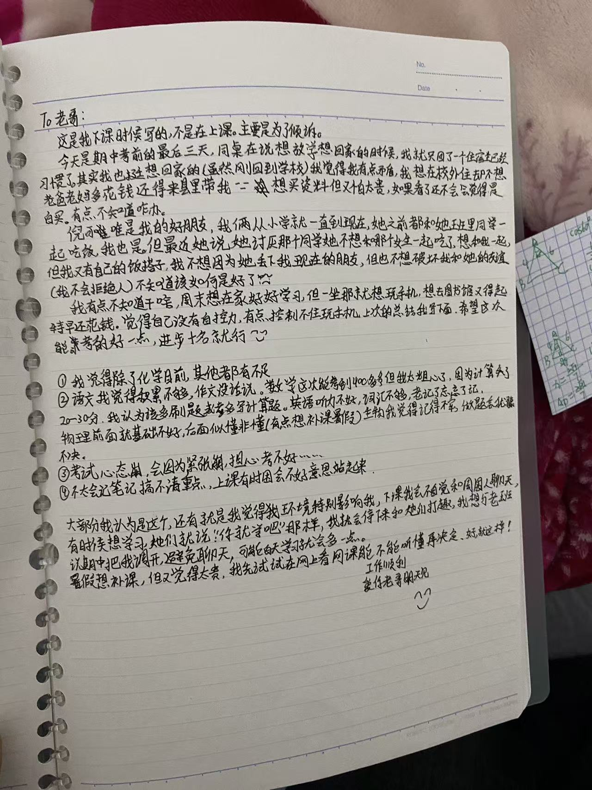

你写的内容我后来看了，以下是我的一些想法

1. 想家，是正常的，说明家庭给你带来的是很正向的感觉，是一件非常好的事情，那就能回家就尽量回回家，没事儿
2. 想在外面租房子住：就像我上次说的，拆清楚自己到底是怎么想的，得是具体的原因，是和同学不愉快，还是想晚上多学习，还是想玩手机，还是什么，不要骗自己，要内心真实想法。然后再针对每一个点讨论必要性
3. 买资料怕贵，一样的，拆成几个可以得到答案的问题：资料买了会看、会做吗？资料贵的夸张吗？至于看了还不会那是别的问题，说明学习方法等有问题，那再去拆分学习方法的问题
4. 和朋友吃饭，这个我不是很懂你们啊，男生和女生的相处方式、感情细腻度也不一样，要我觉得，就直接拉着一起吃饭，前面几次可能有点不熟、但只要聊起来了，就好了，多一个朋友多一条路，后面你没空时，他俩没准能一起吃饭呢。大家都是朋友，不要想太多，这点小事都不能包容、或者不能直说的还叫什么好朋友？
5. 在家里玩手机的问题，这个确实，一般人很难控制，我现在也是，周末会去图书馆，但家里去图书馆有点费劲。我觉得你可以把家里收出来一个地方当图书馆，不允许把手机带进来，只能看书，买个闹钟在桌子上看时间。比如你那个房间，南边靠窗的那个桌子，那个就是我之前初中、高中在家学习的地方，靠窗，风、光线都很好，你床边还有点暗了，对眼睛不好其实。你把那一片收拾出来，就用来学习，床头就用来玩，什么区域干什么活，真的需要的话，后面让我爸直接在南边兼一面墙，就当个书房，不过北边没有窗户，会有点太暗了，后话。
6. 环境影响人，那是肯定的，人的自控力都是有限的，但也不要过度苛责自己，只要不太过分就好。我一直觉得，很多科目，课上能解决 80、90% 的问题，比如生物、地理、物理、数学、这些，课后只是防止自己忘记了。我觉得课间 10 分钟不用过度学习，适当放松是有好处的，把自己从上一节课抽离出来，迎接下一节课，也不会让自己精神上出现“我一直在学习，好累啊”的感觉，只要课上认真听了，课间休息休息无所谓，晚自习好好规划一天的复习啥的就好了。至于调位置，一样的，拆点：你觉得他们在课上会影响你吗？你们关系不好吗？你们关系太好了吗？等
7. 补课也是一样的：为什么要补？补什么？不补有没有其他方式？具体多少钱？

考试部分：

1、首先化学很棒，鼓励

2、语文：那就看看该怎么积累，制定一个计划

3、数学：计算失分，是指题目会，算错了吗？如果是的话，那我觉得不是多刷题能解决的，应该是做题时的感觉，一定要在平时的时候就认真的对待每一题，每一个计算步骤，验算清楚。可以根据你实际错的是哪些题，好好想想当时是怎么想的，整理错题集，写出当时的感觉，为啥错

4、英语，我也没啥招，好好背单词吧

5、物理确实得弄懂，不能留历史账，所有的问题都要在最近的时间弄懂，可以找老师问，没事儿，老师很喜欢问问题的学生的，问一题，做一系列相关的题巩固，物理很多时候是一种感觉，都是一类一类的题。可以的，如果你拆分想清楚了，可以补课的，你自己去调研一下有哪些补课机构，具体补哪一块，防止是那种补了没用的，多少钱，怎么上课等等

6、生物主要靠课上听懂，课后需要背一些基本的知识，老头讲的应该还是挺好的，听的时候一定要认真听，和物理一样，当天弄懂，不要留，因为给他们的课后时间不多

7、心态，这个就没啥好办法了，一个人一个心态，我只能说点安慰的话，这就一个普通考试，还是高一的，紧张啥，没事儿的，你只要平时好好学习了，就算高考没考好也不会有人说你，你看你宇涵哥其实就没考好，但没人会说。放宽心，我们家从来不会因为谁没考好说谁，说的都是态度问题。而态度，是从平时看出来的，不是考试的分数

8、记笔记，可以找好同学要他们的笔记看他们是怎么记的，困一定要站起来，我之前就在老头的课上被他发现几次，后来我就一上他的课，我就到走廊最后头站起来。还被他夸过“你看，王详啊，人家就自觉，困了自己就去后面站着（也可能是挖苦，哈哈哈）”

最后：一样的，不要笼统，拆成小点，然后挨个解决

最最后，关于学习上的事，我确实是脱离学校太久了，你可以找你雨涵哥问，放着这么厉害一个人在家里不问不是浪费，有任何学习上的问题，都可以问他，学习习惯、复习、补课、等等