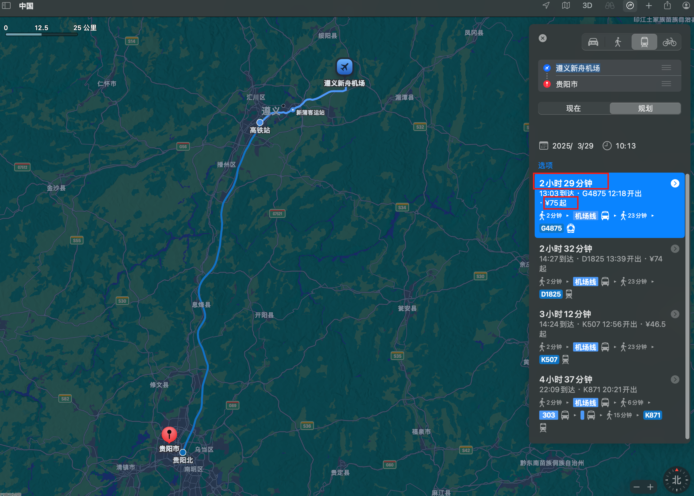

# 20250403 - 20250406 四天三夜贵阳行

## 一、租车方案

### 1.1 方案一 遵义 租车

租车 915元（包保险）

遵义到贵阳 164公里 邮费 82元 时间 2h

过路费：82元

共：915 + 82 * 3 =1,161 元

### 1.2 方案二 贵阳租车

租车 1045元 （包保险）

高铁去遵义 100元

#### 遵义新舟机场 - 遵义高铁站 41公里 

##### 1.2.1 打车 

打车80元

共：1045 + (80 + 100) * 2 =1,405 元

时间：40分钟+ 40 分钟 = 1h20m

##### 1.2.2 地铁、公交

公共交通50元

共：1045 + (100 + 50) * 2 =1,345 元

时间：2h30m

### 总结

方案二、一差价： 

- 公共交通：1345-1161=184元
- 打车：1405-1161=244元

## 自驾方案

### 贵阳 - 荔波小七孔

## 花费记录

| 项目                               | 花费   | 时间      |
| ---------------------------------- | ------ | --------- |
| 241.68                             | 油费   | 0407      |
| 102                                | 过路费 | 0403      |
| 200                                | 油费   | 0405      |
| 100                                | 烤小肠 | 0405      |
| 150                                | 油费   | 0404      |
| 1116                               | 租车   | 0403-0406 |
| 111，189，189，148                 |        |           |
| 50 * 4， 51 * 4，73，20，     -120 |        |           |

